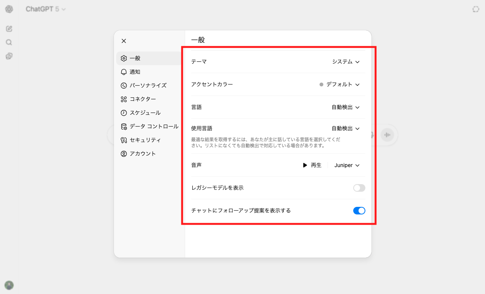
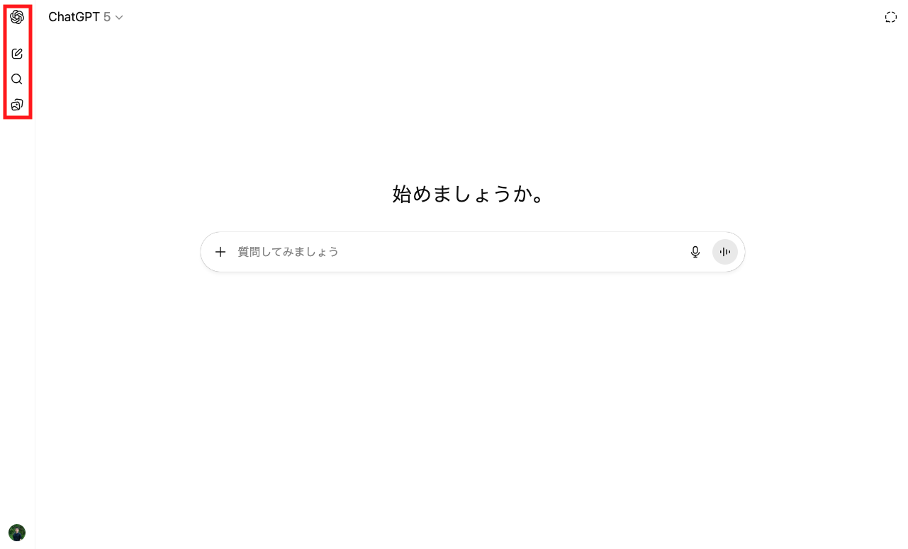
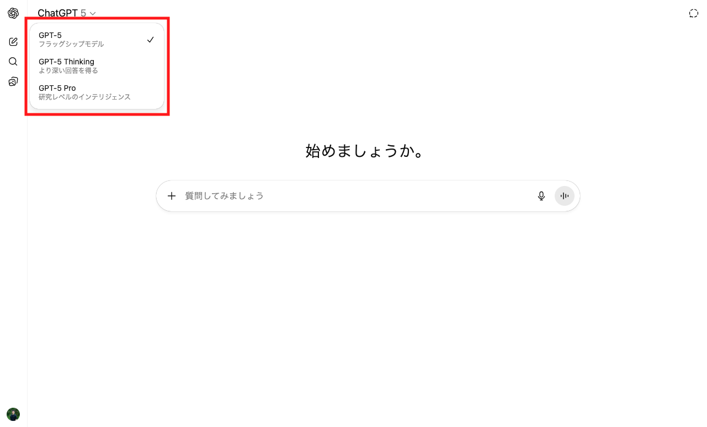
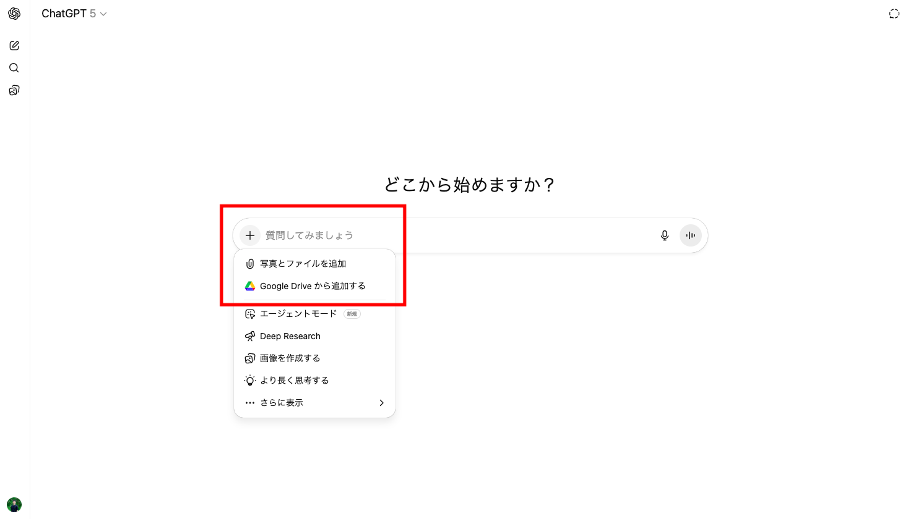
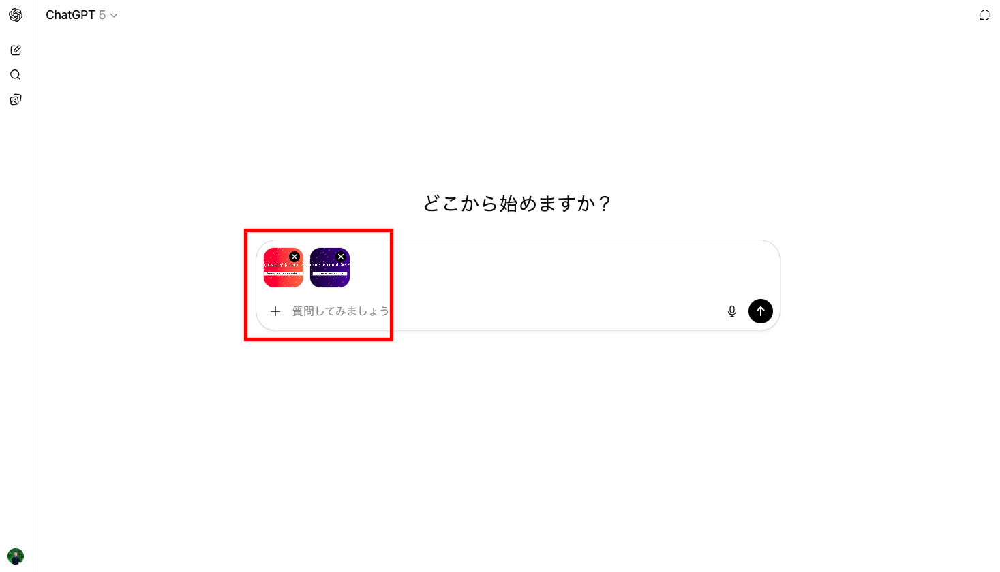
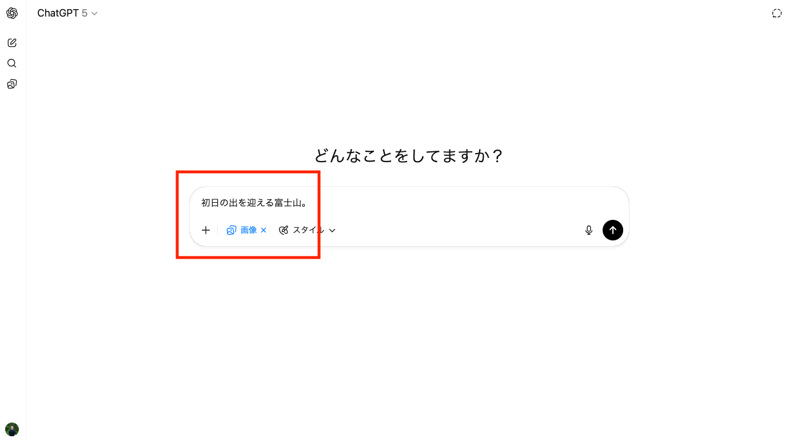
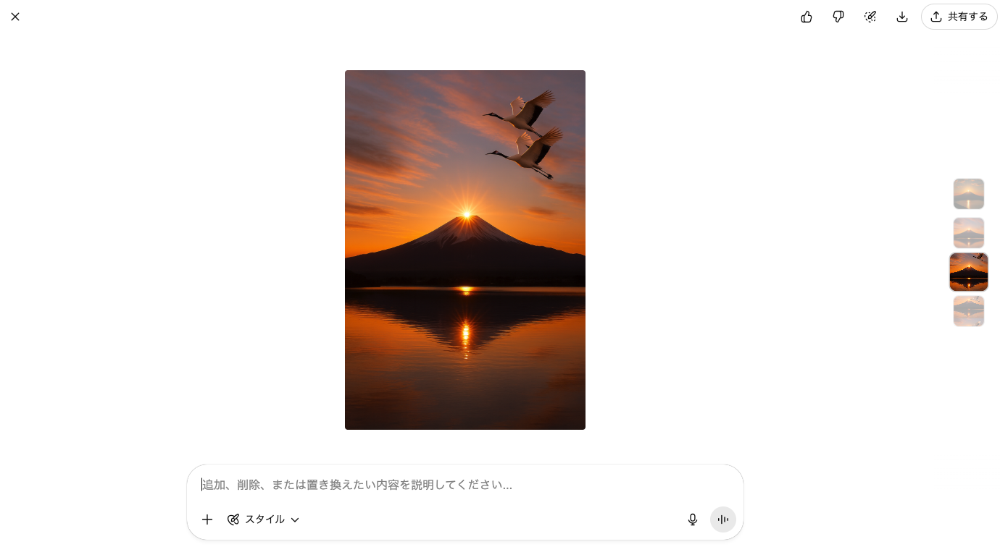
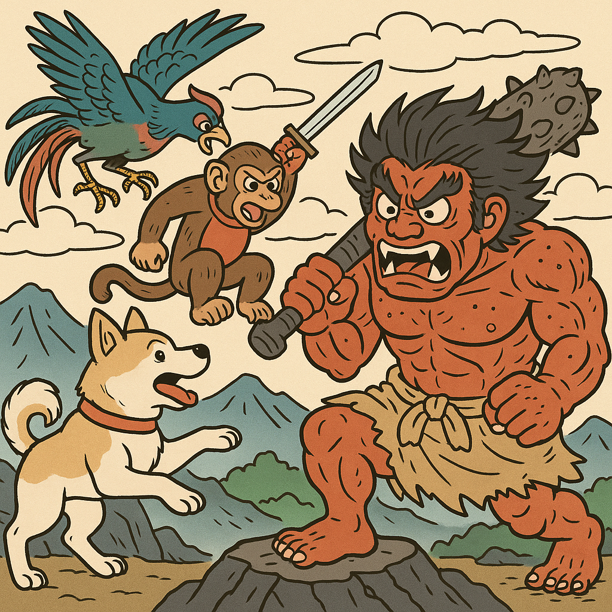
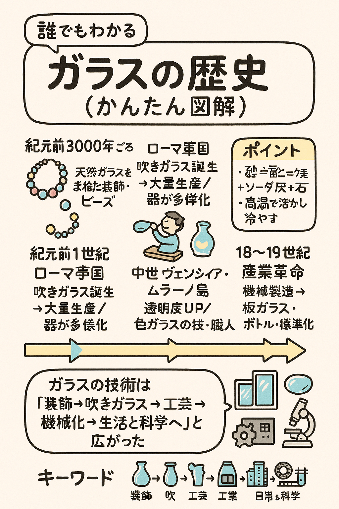

# 📘 Level 1: 基本機能テキスト
**対象**: Level 1受講者

## 第1章: 基本チャット機能とプロンプトエンジニアリング

### 1-1 基本的な質問と回答

| 項目 | 内容 |
|------|------|
| **学習目標** | ChatGPTとの効果的な対話方法を習得 |
| **対象機能** | 基本チャット |

#### 📚 この章で学ぶこと

📌 **1. ChatGPT Teamの基本的な使い方**

まず最初に、ChatGPT Teamの画面構成と基本的な操作方法について説明します。

**チャットの始め方**

ChatGPT Teamでチャットを開始するには、画面下部のチャット入力欄に質問や指示を入力します。入力欄は「Message ChatGPT...」というプレースホルダーテキストが表示されており、ここをクリックして文章を入力してください。入力後、Enterキーを押すかチャット欄右端の送信ボタンをクリックすることで、AIとの対話が開始されます。



**チャット履歴の管理**

左サイドバーには過去の会話履歴が時系列で表示されます。各チャットには自動で件名が付けられますが、重要な会話には手動でタイトルを編集することをお勧めします。チャット履歴の上にカーソルを合わせると、編集や削除のオプションが表示されます。



**モデル選択の確認**

画面上部のチャット入力欄の上に、現在選択されているAIモデルが表示されています。ChatGPT Teamでは「GPT-4」が利用可能です。モデル名をクリックすると選択画面が開き、用途に応じてモデルを変更できます。通常のビジネス利用では「GPT-4」を選択することをお勧めします。



**ツール選定について**

チャット入力欄の近くに、利用可能なツール（Code Interpreter、Web Browsing、File Upload等）の選択オプションが表示されています。データ分析を行う場合は「Code Interpreter」、最新情報が必要な場合は「Web Browsing」、ファイルを処理する場合は「File Upload」を選択してください。


🎯 **2. 指示のポイント - 明確な指示文の7つのコツ**

ChatGPTから高品質な回答を得るための基本的な指示方法について解説します。効果的なプロンプト作成の基礎となる7つのコツを実例とともに学びます。

**1. 明確な指示を出す**

あいまいな表現は避け、具体的に"何をどうしてほしいか"を明記します。ChatGPTは曖昧な指示では適切な回答を生成できません。

```
❌ 悪い例：「要約してください」
✅ 良い例：「この資料を3つのポイントに絞って要約してください」
```

**2. 役割や立場を与える**

「プロの編集者として」や「ITエンジニアとして」など、AIに求めるペルソナ・目線を指定することで、アウトプットの一貫性と専門性が高まります。

```
❌ 悪い例：「この企画について意見をください」
✅ 良い例：「マーケティング担当者として、この企画の改善点を教えてください」
```

**3. 条件や制約、出力形式を指定**

文字数や項目数、フォーマット（箇条書き・表など）を明示することで、そのまま業務で使える形式の回答を得られます。

```
❌ 悪い例：「分かりやすく整理してください」
✅ 良い例：「箇条書きで5つ、各項目100文字以内で整理してください」
```

**4. 指示文と補足情報を分けて書く**

「〇〇してください」という主指示と、補足条件や前提知識を分離することで、AIが文脈を理解しやすくなります。

```
❌ 悪い例：「新商品のアイデアを考えてください。20代女性向けで健康志向で価格は1000円以下で」
✅ 良い例：「新商品のアイデアを3つ提案してください。

【条件】
- ターゲット：20代女性
- コンセプト：健康志向
- 価格帯：1000円以下」
```

**5. コンテキストや前提情報を与える**

ターゲット（読者層や利用シーン）や背景（どんな目的か）などを一緒に伝えることで、より適切で実用的な回答を得られます。

```
❌ 悪い例：「プレゼンのコツを教えて」
✅ 良い例：「営業部門の新人向けに、初回顧客訪問でのプレゼンのコツを3つ教えてください」
```

**6. 数値や具体的キーワードを活用**

「なるべく」「たくさん」など抽象的な表現より、「5つ挙げて」「100文字以内で」など数値指定を使用することで、期待する回答を確実に得られます。

```
❌ 悪い例：「改善案をたくさん出してください」
✅ 良い例：「具体的な改善案を優先度順に5つ提案してください」
```

**7. まずはシンプルに、必要に応じて調整**

プロンプトは何度でも試行錯誤できます。一度に詰め込まず、まずは簡単に始めて、徐々に具体化していくことが効果的です。

```
❌ 悪い例：最初から複雑で長いプロンプトを作成
✅ 良い例：「売上分析をしてください」→「売上データから傾向を分析してください」→「売上データから傾向を分析し、改善提案を3つしてください」
```

⚠️ **3. ChatGPT利用の注意点**

ChatGPTを安全かつ適切に活用するために押さえておくべき重要な注意事項を説明します。セキュリティリスクを回避し、倫理的で効果的な活用方法を身につけます。

**機密情報の取り扱い**

社外秘情報や個人情報は絶対に入力しないでください。ChatGPTに入力した情報は学習データとして使用される可能性があり、情報漏洩のリスクがあります。顧客リスト、財務情報、人事情報などの機密データを扱う場合は、データを匿名化するか、社内の承認されたツールを使用してください。

**情報の正確性の確認**

ChatGPTが生成した内容は必ず事実確認を行ってください。AIは時として不正確な情報や古い情報を提供することがあります。特に数値データ、法律情報、医療情報などの重要な内容については、公式な情報源での確認が不可欠です。

**著作権への配慮**

既存の著作物をそのまま複製することは避けてください。ChatGPTが生成するコンテンツも著作権法の対象となる場合があります。商用利用する際は、生成されたコンテンツが既存の著作物と類似していないか確認し、必要に応じて法的なアドバイスを求めてください。

**利用規約の遵守**

OpenAIの利用規約や自社のガイドラインを必ず遵守してください。不適切な用途（差別的コンテンツの生成、違法行為の支援など）での使用は禁止されています。また、組織で利用する場合は、IT部門やコンプライアンス部門の承認を得ることを推奨します。

#### ハンズオン演習

> 
> 💡 **演習の進め方**
>
> 1. 各演習の状況設定を理解する
> 2. 記載されているプロンプト例をそのまま試す
> 3. 出力結果を確認し、より良い結果を得るためにプロンプトを修正します
> 4. 演習1〜3まで完了後、ユー スケース例を参考に自業務での活用を検討してください
> 

**【演習1】**

| テーマ | 状況設定 |
|------|------|
| アイデア出し | 社内イベントのアイデアを複数出したい |

**プロンプト例**:
```
社内イベントのアイデアを5つ提案してください。

【条件】
- 参加者：全社員約100名
- 予算：30万円以内
- 時期：来月の金曜日夕方
- 目的：チーム結束力の向上
```

**【演習2】**

| テーマ | 状況設定 |
|------|------|
| 要約 | 長い会議資料を簡潔にまとめたい |

**プロンプト例**:
```
この会議資料を箇条書きで3つのポイントに要約してください。
各ポイントは50文字以内でお願いします。

（ここに会議資料の内容をコピー&ペースト）
```

**【演習3】**

| テーマ | 状況設定 |
|------|------|
| 調査 | 競合他社の基本情報を調べたい |

**プロンプト例**:
```
マーケティング担当者として、〇〇業界の主要な競合3社について教えてください。
各社の特徴を簡潔に説明してください。

（注：実際の社名を入れて試してください）
```

**ユースケース例**：自業務への応用

学習した内容を次も参考に自業務に生かしてください。

```
**営業部門の例**：
- 週次営業報告書の要点整理
- 顧客訪問後のフォローアップメール作成
- 競合他社の新サービス分析

**人事部門の例**：
- 採用面接の評価基準作成
- 社内規程の分かりやすい要約
- 新入社員向けFAQ作成

**マーケティング部門の例**：
- プレスリリースの構成案作成
- 顧客アンケートの分析と施策提案
- イベント企画のアイデア出し
```
<br>

---
<br>

### 1-2 プロンプトエンジニアリング

| 項目 | 内容 |
|------|------|
| **学習目標** | 高度なプロンプト技術を活用し、ChatGPTから高品質な出力を得る技術の習得 |
| **対象機能** | 基本チャット |

#### 📚 この章で学ぶこと

🚀 **3つの強力なプロンプト技術**

ChatGPTの性能を最大限引き出すために、以下の3つの技術を組み合わせて活用します。構造化・例示学習・思考の連鎖という高度なプロンプト技術を習得し、より高品質な出力を得る方法を学びます。

📋 **1. 構造化プロンプト**

情報を階層的・体系的に整理して提示することで、AIの理解度と出力品質を向上させます。プロンプトを論理的に構造化することで、期待する結果を正確に得る技術を身につけます。

効果的な構造化プロンプトの基本構成：

```markdown
# 依頼
具体的な依頼内容を明記

## 背景情報
- 状況やコンテキストを説明
- 目的を明確化

## 条件・制約
- 守るべき制約
- 品質基準
- 文字数や項目数の制限

## 参考情報
- 参考となる情報やデータ
- 具体例や過去事例

## 出力形式
- 最終的に欲しい形式を明記
- レイアウトや構成の指定
```

🎯 **2. Few-Shot Learning（例示学習）**

具体例を示すことで、期待する出力形式や品質をAIに学習させます。良い例を提示することで、AIに望ましい出力パターンを効果的に伝える技術を習得します。

```markdown
# 依頼
製品の特徴を魅力的なキャッチコピーにしてください。

## 入力例1
製品: 「持ち運びやすい軽量ノートPC、バッテリー最大12時間」

コピー:
「どこでも、思いのまま。軽量×長時間バッテリーの自由。」

## 入力例2
製品: 「高保湿成分配合のスキンケアクリーム」

コピー:
「朝までうるおい続く。あなたの肌に、ご褒美の一滴。」

## 実際のタスク
以下の製品の特徴を上記の形式でキャッチコピーにしてください：

製品: 「音声認識機能付きワイヤレスイヤホン、ノイズキャンセリング対応」
```

💭 **3. Chain of Thought（思考の連鎖）**

段階的な思考プロセスを明示することで、複雑な問題解決や分析を促します。特に原因分析、戦略立案、複雑な計算、多段階の判断が必要な場面で威力を発揮します。ステップバイステップの指示により、論理的で詳細な分析結果を得る手法を学びます。

```markdown
# 依頼
売上が前年比20%減少している原因を分析してください。

## 分析プロセス
以下の手順で段階的に分析してください：

### ステップ1：要因の列挙
売上減少の可能性がある要因を網羅的に列挙してください

### ステップ2：影響度評価
各要因について、入手可能なデータから影響度を評価してください

### ステップ3：重要要因の特定
最も影響が大きい要因トップ3を特定してください

### ステップ4：対策案の提案
それぞれの要因に対する具体的な対策案を提案してください
```

#### ハンズオン演習

> 
> 💡 **演習の進め方**
>
> 1. 各演習の状況設定を理解する
> 2. 記載されているプロンプト例をそのまま試す
> 3. 出力結果を確認し、より良い結果を得るためにプロンプトを修正します
> 4. 演習1〜3まで完了後、ユースケース例を参考に自業務での活用を検討してください
> 

**【演習1】**

| テーマ | 状況設定 |
|------|------|
| 構造化プロンプト | 新商品企画のアイデアを体系的に整理したい |

**プロンプト例**:
```
# 依頼
新商品企画案を3つ提案してください

## 背景情報
- 会社：健康食品メーカー
- ターゲット：20-30代女性

## 条件・制約
- 予算：500万円以内
- 販売チャネル：オンライン中心
- 発売時期：6ヶ月後

## 出力形式
以下の項目を含む企画案を3つ提案してください：
1. 商品名とコンセプト
2. 主要な機能・特徴
3. 価格設定
```

**【演習2】**

| テーマ | 状況設定 |
|------|------|
| Few-Shot Learning | 商品レビューを統一された形式で要約したい |

**プロンプト例**:
```
# 依頼
以下の例を参考に、商品レビューを要約してください。

## 入力例1
レビュー: 「デザインはとても気に入っています。軽くて持ち運びやすく、バッテリーも長持ちします。ただ、キーボードの打鍵感が少し安っぽいです。」
要約:
「デザインと携帯性は高評価だが、キーボードの質感に不満あり。」

## 入力例2
レビュー: 「初めて購入しましたが、とても使いやすいです。説明書もわかりやすく、すぐに使い始められました。」
要約:
「初心者でもすぐ使えるわかりやすい製品。」

## 実際のタスク
以下のレビューを上記の形式で要約してください：

レビュー: 「デザインは気に入りましたが、思ったより小さく、価格も高めでした。」
```

**【演習3】**

| テーマ | 状況設定 |
|------|------|
| Chain of Thought | 新規事業のテーマを段階的に検討したい |

**プロンプト例**:
```
# 依頼
IT業界での新規事業のテーマを検討してください

## 参考情報
### 市場環境（PEST分析）
- 政治：データ保護規制（GDPR、個人情報保護法）の強化
- 経済：DXによる投資拡大、リモートワーク普及によるクラウド需要増
- 社会：高齢化社会、働き方改革、人材不足の深刻化
- 技術：AI・機械学習の普及、5G・IoTの拡大、量子コンピューティング

### 自社のコア・コンピタンス
- システム開発・運用の豊富な実績（20年間）
- 金融機関向けセキュリティ技術の専門知識
- 1000社以上の中小企業との取引実績とネットワーク

## 分析プロセス
以下の手順で段階的に分析してください：

### ステップ1：市場環境の整理
上記の参考情報を踏まえ、IT業界の現在のトレンドと課題を3つずつ挙げてください

### ステップ2：自社強みの活用
参考情報の自社コア・コンピタンスを活かせる分野を特定してください

### ステップ3：機会の発見
ステップ1と2を踏まえ、新規事業の機会を5つ特定してください

### ステップ4：事業テーマの提案
最も有望な事業テーマを3つ選択し、それぞれの概要とポテンシャルを説明してください
```

**ユースケース例**：自業務への応用

学習した内容を次も参考に自業務に生かしてください。

```
**戦略企画部門の例**：
- 新規事業計画書の構造化
- 市場分析レポートの段階的思考プロセス
- 競合分析における具体例活用

**商品開発部門の例**：
- 製品コンセプト開発での例示学習
- 機能要件定義の構造化
- ユーザーフィードバック分析の段階的アプローチ

**人材開発部門の例**：
- 研修プログラム設計の思考プロセス
- 評価制度設計の構造化
- 組織課題分析での段階的思考
```
<br>

---
<br>

### 1-3 出力形式の制御

| 項目 | 内容 |
|------|------|
| **学習目標** | 期待する形式での出力を得る技術の習得 |
| **対象機能** | 基本チャット |

#### 📚 この章で学ぶこと

📝 **出力形式を制御する重要性**

ChatGPTなどのLLMは創造的で柔軟なアウトプットを生成しますが、同じ質問でも回答が毎回異なるという特性があります。創造的なタスクでは有効ですが、定型業務や運用オペレーションでは一貫性のある固定的なアウトプットが求められます。適切な形式指定により、そのまま業務で使える形式での回答を得ることで、作業効率が大幅に向上し、後続の作業時間を削減できます。


🎨 **主要な出力形式パターン**

ビジネスシーンで頻繁に使われる出力形式を理解し、目的に応じた最適な形式選択ができるようになります。

**1. 箇条書き形式**

要点整理に最適で、番号付き/番号なしの使い分けや階層構造での整理が可能です。

```
• 主要ポイント1
• 主要ポイント2
  - 詳細項目A
  - 詳細項目B
• 主要ポイント3

1. 優先度の高い項目
2. 次に重要な項目  
3. 補助的な項目
```

**2. 表形式**

比較分析に最適で、Markdown形式やExcel貼り付け可能な形式で出力されます。

```
| 項目 | A社 | B社 | C社 |
|------|-----|-----|-----|
| 売上 | 100億 | 80億 | 120億 |
| シェア | 25% | 20% | 30% |
| 特徴 | 技術力 | 価格 | ブランド |
```

**3. 文字数・段落指定**

SNS投稿、エレベーターピッチ、エグゼクティブサマリーなど用途に応じた文字数制限が可能です。

```
【280文字版】
弊社の新サービスは...（280文字以内）

【1分ピッチ版】  
弊社は...（話すと約1分の文字数）

【エグゼクティブサマリー】
概要：...
効果：...
投資：...（A4用紙1枚程度）
```

**4. 構造化データ（JSON/XML）**

システム連携やプログラムでの処理に最適で、データの再利用が容易です。

```json
{
  "企業名": "A社",
  "業界": "IT",
  "従業員数": 500,
  "売上": {
    "2023年": 100,
    "2024年": 120
  }
}
```

💡 **形式指定のベストプラクティス**

曖昧な指定を避け、期待する出力を確実に得るための具体的な指定方法を学びます。各出力形式に対応したプロンプト例：

**箇条書き形式の指定例：**
```
# 出力形式
以下の形式で箇条書きにしてください：
• メインポイント（太字）
  - 詳細説明
  - 具体例
```

**表形式の指定例：**
```
# 出力形式  
以下の形式でMarkdown表を作成してください：
| 項目 | 内容 | 評価 |
|------|------|------|
| 項目名 | 詳細内容 | ○/△/× |
```

**文字数指定の例：**
```
# 出力形式
・見出し：30文字以内
・本文：各段落100文字以内
・全体：500文字以内で完結
```

**構造化データの指定例：**
```  
# 出力形式
以下のJSON形式で出力してください：
{
  "項目名": "値",
  "データ配列": ["要素1", "要素2"],
  "数値項目": 数値
}
```

#### ハンズオン演習

**【演習1】**

| テーマ | 状況設定 |
|------|------|
| 箇条書き形式での出力 | 社内の業務改善アイデアを整理したい |

**プロンプト例**:
```
業務効率化のアイデアを5つ提案してください。

# 出力形式
以下の形式で箇条書きにしてください：
• **アイデア名**
  - 具体的な内容
  - 期待効果
  - 実施難易度（高/中/低）
```

**【演習2】**

| テーマ | 状況設定 |
|------|------|
| 表形式での出力 | 複数の企業情報をまとめて比較分析したい |

**プロンプト例**:
```
以下の企業情報を比較表にまとめてください。

当社では先月、3つの競合他社に関する市場調査を実施しました。第一の企業は情報技術分野に特化しており、社員は約300名程度で、年間の売上高は50億円台となっています。この企業の特徴として人工知能関連の技術開発力に優れています。次に調査した企業は製造業界で事業を展開しており、従業員数は500名弱、売上規模は80億円前後で推移しています。品質管理システムの導入と運用が他社より優秀であるという評価を得ています。最後の企業は小売業界に位置し、スタッフ数は200名ほど、年商は30億円程度となっており、顧客対応サービスの質の高さで差別化を図っています。

# 出力形式
以下の形式でMarkdown表を作成してください：
| 企業名 | 業界 | 従業員数 | 売上 | 強み |
|--------|------|----------|------|------|
```

**【演習3】**

| テーマ | 状況設定 |
|------|------|
| 文字数指定での出力 | ブログ記事の概要を決められた文字数で作成したい |

**プロンプト例**:
```
「リモートワークの効果的な進め方」について記事を作成してください。

# 出力形式
・タイトル：30文字以内
・導入文：100文字以内
・本文：各段落150文字以内で3段落
・まとめ：80文字以内

# 文字数制御について：
・一度内容を生成後、文字数を再確認し、必要に応じて調整を依頼してください
・文字数カウントは日本語文字数での計算です
```

**ユースケース例**：自業務への応用

学習した内容を次も参考に自業務に生かしてください。

```
**経営企画部門の例**：
- 競合分析レポートの表形式整理
- エグゼクティブサマリーの構造化
- 戦略資料のJSON形式データ化

**プロダクト開発部門の例**：
- ユーザーフィードバックの分類・整理
- 機能要件の優先度マトリックス
- 開発計画の箇条書き・表形式整理

**カスタマーサポート部門の例**：
- FAQ作成の階層構造整理
- 問い合わせ分析のカテゴリ分類
- 対応手順のチェックリスト化
```
<br>

---
<br>

### 1-4 用途別プロンプト作成

| 項目 | 内容 |
|------|------|
| **学習目標** | 目的に応じた最適なプロンプト設計技術の習得 |
| **対象機能** | 基本チャット |

#### 📚 この章で学ぶこと

🎯 **用途別プロンプト設計の重要性**

目的に応じて適切なプロンプト構造を選ぶことで、ChatGPTから最適な回答を引き出せます。文章の作成・チェック・翻訳・情報整形・アイデア出し・コード生成といった異なる用途に最適化されたプロンプト設計技術を身につけます。

📋 **6つの主要用途とプロンプトパターン**

ビジネスでよく使われる6つの主要用途について、それぞれに最適化されたプロンプトパターンを学びます。

**1. 文章の作成**

ビジネス文書、提案書、メールなどの作成に活用します。目的と読み手を明確にすることで、適切な文体と構成の文章を生成できます。

```
〇〇向けの△△を作成してください。
・目的：□□
・文体：丁寧語/カジュアル
・文字数：〇〇字程度
```

**2. 文章のチェック**

既存の文章の校正、改善提案、読みやすさの向上に活用します。具体的なチェック観点を指定することで、的確な改善案を得られます。

```
以下の文章をチェックして改善案を提案してください。
・観点：誤字脱字、文法、読みやすさ
・対象読者：〇〇
・改善理由も併記してください
```

**3. 翻訳**

多言語間の翻訳に活用します。文体・トーンの指定や専門用語の扱い方を明確にすることで、適切な翻訳を得られます。

```
以下を〇〇語に翻訳してください。
・文体：ビジネス/カジュアル
・読み手：〇〇
・専門用語は原文を併記
```

**4. 情報の整形**

文章形式の情報を表形式やリスト形式に整理・構造化します。散らばった情報を体系的に整理することで、理解しやすい形式に変換できます。

```
以下の情報を表形式で整理してください。
・列項目：〇〇、△△、□□
・並び順：〇〇順
・追加情報があれば補完
```

**5. アイデア出し**

ブレインストーミング、企画案の創出、問題解決のアイデア生成に活用します。制約条件を設定することで、実現可能性の高いアイデアを得られます。

```
〇〇のアイデアを△個提案してください。
・条件：□□
・予算：〇〇円以内
・期間：△週間
・実現可能性も併記
```

**6. コードの生成**

プログラミングコード、関数、スクリプトの生成に活用します。言語と具体的な機能を指定することで、動作するコードを得られます。

```
〇〇を実現する△△言語のコードを作成してください。
・機能：□□
・入力：〇〇
・出力：△△
・コメントも含めて
```


#### ハンズオン演習

> 
> 💡 **演習の進め方**
>
> 1. 各演習の状況設定を理解する
> 2. 記載されているプロンプト例をそのまま試す
> 3. 出力結果を確認し、より良い結果を得るためにプロンプトを修正します
> 4. 演習1〜3まで完了後、ユースケース例を参考に自業務での活用を検討してください
> 

**【演習1】**

| テーマ | 状況設定 |
|------|------|
| 文章のチェック | 作成した契約書の品質を向上させたい |

**参照ファイル**: [sample_document.txt](https://drive.google.com/file/d/1-a_JY87ycWR3aLgDnI4n40B5I_zkn12-/view?usp=sharing)

**プロンプト例**:
```
上記ファイルの文章をチェックして改善案を提案してください。
・観点：誤字脱字、文法、読みやすさ、ビジネス文書として適切な表現
・対象読者：経営陣
・改善理由も併記してください

{sample_document.txtの内容をここにコピー&ペーストしてください}
```

**【演習2】**

| テーマ | 状況設定 |
|------|------|
| 情報の整形 | 従業員満足度調査結果から優先対応すべき課題を特定したい |

**参照ファイル**: [survey_results.txt](https://drive.google.com/file/d/12BdbLmbZFbiFopI5jyb3yqYSVw7mn-7r/view?usp=sharing)

**プロンプト例**:
```
上記のアンケート結果を分析して、以下の表形式で整理してください：

# 出力形式
**1. 満足度が低い（3以下）社員の特徴分析**
| 項目 | 該当人数 | 主な特徴 | 具体的課題 |
|------|----------|----------|-----------|

**2. 部署別満足度ランキング**
| 順位 | 部署名 | 平均満足度 | 主要課題 |
|------|--------|------------|----------|

**3. 優先対応すべき改善施策（上位5つ）**
| 優先度 | 改善項目 | 影響範囲 | 期待効果 |
|--------|----------|----------|----------|

{survey_results.txtの内容をここにコピー&ペーストしてください}
```

**【演習3】**

| テーマ | 状況設定 |
|------|------|
| コードの生成 | マーケティング会社のウェブサイトを作成したい |

**プロンプト例**:
```
デジタルマーケティング会社のコーポレートサイトのHTMLコードを作成してください。

# 要件
・会社名：「Digital Innovation Partners」
・サービス：SEO対策、SNS運用、Web広告運用、コンテンツマーケティング
・特徴：データドリブンなアプローチ、ROI重視、最新技術活用
・構成：ヘッダー、ヒーロセクション、サービス紹介、会社概要、お問い合わせ
・デザイン：モダンで信頼感のあるデザイン、レスポンシブ対応

# 出力形式
・HTML、CSS、軽微なJavaScriptを含む完全なコード
・コメントを日本語で記載
・実際にブラウザで表示可能な状態
```

**ユースケース例**：自業務への応用

学習した内容を次も参考に自業務に生かしてください。

```
**文章の作成・チェック部門の例**：
- ビジネス文書の作成と品質向上
- メール文面の校正と改善提案
- 提案書の構成と表現の最適化

**情報整理・分析部門の例**：
- 散らばった情報の構造化と表形式整理
- 競合分析データの比較表作成
- 調査結果の分類と優先順位付け

**業務効率化・IT部門の例**：
- 定型業務の自動化コード生成
- データ処理スクリプトの作成
- 簡単な分析ツールの開発支援
```
<br>

---
<br>

## 第2章: ファイルアップロード機能活用

### 2-1 Office文書処理

| 項目 | 内容 |
|------|------|
| **学習目標** | Word/Excel/PowerPoint/PDF文書の効果的な活用法習得 |
| **対象機能** | ファイルアップロード（Word/Excel/PPT/PDF） |

#### 📚 この章で学ぶこと

📁 **ファイルアップロード機能の革新性**

ChatGPT Teamのファイルアップロード機能は、従来の文書作業を大幅に効率化します。単なるファイル読み込みではなく、内容の理解と高度な分析を同時に実現します。チャット入力欄の左側にあるクリップアイコン（📎）をクリックするか、ファイルを直接ドラッグ&ドロップすることで、簡単にファイルをアップロードできます。



📊 **対応ファイル形式と特徴**

1. **Word文書（.docx）**

   - 契約書、報告書、企画書の分析
   - 文章構造の評価と改善提案
   - 重要条項の抽出と要約

2. **Excel文書（.xlsx）**

   - データの基本統計と傾向分析
   - グラフ化可能な形でのデータ整理
   - 数値データからの洞察抽出

3. **PowerPoint文書（.pptx）**

   - プレゼン構成の論理性評価
   - スライド間の一貫性チェック
   - 改善ポイントの具体的提案

4. **PDF文書（.pdf）**

   - レイアウト固定文書の正確な読み取り
   - 契約書、学術論文、調査レポートの分析
   - テキスト、表、図表の構造化された解析


#### ハンズオン演習

> 
> 💡 **演習の進め方**
>
> 1. 各演習の状況設定を理解する
> 2. 記載されているプロンプト例をそのまま試す
> 3. 出力結果を確認し、より良い結果を得るためにプロンプトを修正します
> 4. 演習1〜3まで完了後、ユースケース例を参考に自業務での活用を検討してください
> 

**【演習1】**

| テーマ | 状況設定 |
|------|------|
| Word文書分析 | 来年度事業計画書の内容を経営陣に簡潔に説明したい |

**参照ファイル**: [business_plan_2025.docx](https://docs.google.com/document/d/1IDYdHi82eXk33OlS6a0yh5K1iHisGAIw/edit?usp=sharing&ouid=112379965251259358810&rtpof=true&sd=true)

**プロンプト例**:
```
アップロードした事業計画書を読んで、以下を教えてください：
- 重要ポイントを3つ
- 主な数値目標の一覧
- 実現のための課題5つ

{business_plan_2025.docxの内容をアップロードしてください}
```

**【演習2】**

| テーマ | 状況設定 |
|------|------|
| Excel文書分析 | 複雑なExcelファイルの構造と内容を把握したい |

**参照ファイル**: [Toyota_Performance_Management.xlsx](https://docs.google.com/spreadsheets/d/1KQcSRQcAmvepnXB-UZ1T0bYN6lPj3ws0/edit?usp=sharing&ouid=112379965251259358810&rtpof=true&sd=true)

**プロンプト例**:
```
アップロードしたExcelファイルについて以下を教えてください：
- 含まれているシート名とそれぞれの概要
- 各シートの主要な記載内容（データの種類、項目名など）
- ファイル全体の構成から読み取れる目的や用途

{Toyota_Performance_Management.xlsxをアップロードしてください}
```

**【演習3】**

| テーマ | 状況設定 |
|------|------|
| PDF文書分析 | AI技術論文の内容を理解して社内勉強会で発表したい |

**参照ファイル**: [Attention Is All You Need.pdf](https://drive.google.com/file/d/1Rf60J5v9gefleGKzRGNwnf-zGiA6xXXq/view?usp=sharing)

**プロンプト例**:
```
アップロードした論文について：
- 論文の主要な貢献点を3つ教えてください
- Transformerアーキテクチャの革新性を分かりやすく説明してください
- エンジニア向け勉強会（30分）での発表構成を提案してください

{Attention Is All You Need.pdfをアップロードしてください}
```

**ユースケース例**：自業務への応用

学習した内容を次も参考に自業務に生かしてください。

```
**営業部門の例**：
- Word提案資料の内容分析と改善点抽出
- Excel売上データの傾向分析と戦略立案
- PowerPoint営業資料の構成評価と最適化

**人事部門の例**：
- Word人事規程や契約書の重要条項抽出
- Excel人事データの統計分析と可視化提案
- PowerPoint研修資料の効果的構成チェック

**マーケティング部門の例**：
- Word市場調査レポートの要点整理
- Excelキャンペーンデータの効果測定
- PowerPointマーケティング資料の訴求力評価
```
<br>

---
<br>

### 2-2 画像認識・理解

| 項目 | 内容 |
|------|------|
| **学習目標** | ビジョンモデルを使った画像分析技術習得 |
| **対象機能** | ファイルアップロード |

#### 📚 この章で学ぶこと

🖼️ **画像認識機能の革新性**

ChatGPTの画像認識機能は、ビジョンモデルを活用して画像・図表・グラフ・写真・設計図などの視覚情報を理解し、テキストと同様に分析・解釈します。ビジョンモデルは、大量の画像データで学習されたニューラルネットワークで、画像内のオブジェクトや文字、パターンを認識し、それをテキスト形式で説明できます。ファイルアップロード機能やドラッグ&ドロップで簡単に画像をアップロードでき、従来では困難だった視覚情報の自動化された高度分析が可能になります。



📊 **Vision機能の活用領域**

ビジネスシーンでVision機能が威力を発揮する4つの主要領域を理解し、実務での応用事例を学びます。

1. **文書の文字起こし**

   - 手書きメモ・ホワイトボードの内容をテキスト化
   - スキャンした紙文書のデジタル変換
   - 会議資料・付箋の内容を構造化して整理

2. **データの分析**

   - グラフ・チャートから具体的数値の読み取り
   - 複数のグラフを比較した傾向分析
   - ダッシュボード画面からのKPI抽出

3. **現場写真の確認**

   - 工場・店舗・オフィスの状況把握
   - 安全管理・5S活動のチェック
   - 製品・設備の状態確認

4. **設計図・技術資料の読解**

   - CAD図面・配線図の内容理解
   - 技術仕様書の図解部分の解析
   - フローチャート・システム構成図の把握

🎨 **対応画像形式**

ビジネスでよく使用される主要な画像形式と、それぞれの用途に応じた適切な選択方法を理解します。

- **JPEG/JPG**: 写真・現場画像に最適
- **PNG**: 図表・グラフ・スクリーンショットに最適
- **GIF**: シンプルな図解・アイコンに対応
- **WebP**: 高圧縮率の画像形式に対応

#### ハンズオン演習

> 
> 💡 **演習の進め方**
>
> 1. 各演習の状況設定を理解する
> 2. 記載されているプロンプト例をそのまま試す
> 3. 出力結果を確認し、より良い結果を得るためにプロンプトを修正します
> 4. 演習1〜3まで完了後、ユースケース例を参考に自業務での活用を検討してください
> 

**【演習1】**

| テーマ | 状況設定 |
|------|------|
| 手書き文書の文字起こし | 手書きで作成されたドキュメントを正確にデジタル化したい |

**参照ファイル**: [sample_handwriting.png](https://drive.google.com/file/d/1kOFYEWSqUCFwq9gmZeMa9uAe1ztrma8c/view?usp=sharing)

**プロンプト例**:
```
アップロードした手書きドキュメントの画像から：
- 書かれている内容をすべてテキスト化してください
- 読み取りが困難な部分があれば、その箇所を明示してください

{sample_handwriting.pngをアップロードしてください}
```

**【演習2】**

| テーマ | 状況設定 |
|------|------|
| Excelの操作方法確認 | Excel画面のスクリーンショットから具体的な操作方法を理解したい |

**参照ファイル**: [sample_excel_header.png](https://drive.google.com/file/d/1BGuUzWvu6fC-0R4HTQyXlq1ueGSHeVI1/view?usp=sharing)

**プロンプト例**:
```
アップロードしたExcel画面のスクリーンショットを見て：
- 表示されているメニューやリボンの機能について説明してください
- この画面から実行できる主要な操作を5つ挙げてください
- 初心者がよく使う機能とその使い方を教えてください

{sample_excel_header.pngをアップロードしてください}
```

**【演習3】**

| テーマ | 状況設定 |
|------|------|
| 電気図面の解釈 | 閉鎖型配電盤の結線図を読み取り、システム構成を理解したい |

**参照ファイル**: [sample_閉鎖型配電盤_結線図.png](https://drive.google.com/file/d/1aOClzzRQaeSNFCfvuPIY1kg7svkJ9M4N/view?usp=sharing)

**プロンプト例**:
```
アップロードした閉鎖型配電盤の結線図について：
- この配電盤システムの全体的な構成を説明してください
- 主要な電気部品とその役割を特定してください
- 電力の流れと保護機能について概要を説明してください

{sample_閉鎖型配電盤_結線.pngをアップロードしてください}
```

**ユースケース例**：自業務への応用

学習した内容を次も参考に自業務に生かしてください。

```
**営業部門の例**：
- 会議メモのホワイトボード写真からの議事録作成
- 売上グラフ画像からの具体的数値読み取りと分析
- 店舗・現場写真での状況確認と改善提案

**品質管理部門の例**：
- 手書き検査記録のデジタル化と構造化
- 製品写真からの品質チェックと問題点指摘
- 製造現場の5S活動チェック写真の評価

**マーケティング部門の例**：
- 手書きアイデアメモの構造化とデジタル化
- 競合店舗写真からの陳列分析と戦略立案
- イベント会場写真からの改善ポイント抽出
```
<br>

---
<br>

## 第3章: Advanced Data Analysis（ADA）機能

以下、研修内容をブラッシュアップしました。演習問題をシンプルにし、参照ファイルのイメージを追加しました。

### 3-1 Excelデータ分析

| 項目 | 内容 |
|------|------|
| **学習目標** | Advanced Data Analysis機能を活用したExcelデータの高度分析技術習得 |
| **対象機能** | ADA + Excel |

#### 📚 この章で学ぶこと

📊 **Advanced Data Analysis（ADA）機能の革新性**

ChatGPT TeamのAdvanced Data Analysis機能は、ChatGPT内部に安全に隔離された実行環境（サンドボックス）を持ち、その中でPythonコードを自動生成・実行することで、従来のデータ分析を飛躍的に進化させます。

ユーザーが「売上データを分析して」と自然な日本語で指示すると、ChatGPTがその意図を理解し、適切なPythonコードを瞬時に生成・実行します。
単なる表計算を超えて、統計分析・機械学習・高度な可視化まで、プログラミング知識なしに一気通貫で実現できます。

ADA機能は、ユーザーがその活用を明示的に宣言する必要がありません。
Excelファイルをアップロードし、分析を依頼するだけで、ChatGPTが自動的にADA機能を起動し、最適な分析手法を選択してコードを生成・実行します。


さらに、複数のシートを持つExcelファイルの場合、シート選択インターフェースが表示され、必要なシートを選んで個別に分析することができます。
これにより、複雑な表計算データも直感的に操作・分析することが可能です。


🔧 **ADA機能の主要な特徴**

1. **統計解析と相関分析**
   - 平均値、中央値、標準偏差などの基本統計量の算出
   - データ間の相関係数計算と散布図での可視化
   - 回帰分析による要因分析（例：広告費と売上の関係性）
   - 統計的検定による仮説の検証

3. **データクレンジングと前処理**
   - 重複データの自動検出と削除
   - 欠損値の補完（平均値、中央値、前後の値での補間）
   - 異常値の検出とフラグ付け
   - データの正規化や標準化処理

4. **高度な可視化**
   - ヒートマップによる相関行列の表示
   - 箱ひげ図による分布の可視化
   - 時系列データのトレンド分析グラフ
   - 複数軸グラフによる多角的な分析表示

5. **機械学習とパターン認識**
   - クラスタリングによる顧客セグメンテーション
   - 時系列予測による需要予測や売上予測
   - 分類モデルによる顧客の購買確率予測
   - 異常検知アルゴリズムによる不正取引の発見

🔬 **ADAの作動原理**

ADA機能は、ChatGPT内部の隔離された安全な実行環境（サンドボックス）でPythonコードを自動生成・実行する仕組みです。ユーザーが「売上を分析して」と指示すると、ChatGPTがその意図を理解し、適切なPythonコードを瞬時に生成します。このコードは外部ネットワークから遮断された環境で実行され、NumPy（数値計算）、Pandas（データ処理）、Matplotlib（グラフ作成）などの専門ライブラリを活用して分析を行います。実行結果はAIが解釈し、ビジネス文脈に合わせた説明と共に返されます。セッション終了時には環境が完全に破棄されるため、データの機密性も保証されています。

#### ハンズオン演習

> 
> 💡 **演習の進め方**
>
> 1. 各演習の状況設定を理解する
> 2. 記載されているプロンプト例をそのまま試す
> 3. 出力結果を確認し、より良い結果を得るためにプロンプトを修正します
> 4. 演習1〜3まで完了後、ユースケース例を参考に自業務での活用を検討してください
> 

**【演習1】**

| テーマ | 状況設定 |
|------|------|
| 統計解析と相関分析（広告費と売上の関係を見る） | 広告費と売上がどれくらい関係しているかをざっくり把握する |

**参照ファイル**: [sample_marketing_stats.csv](https://drive.google.com/file/d/1mq39aoZrnrzCMT0NxbwUNnr2RQqHZ1P6/view?usp=sharing)

**プロンプト例**:
```
sample_marketing_stats.csv を読み込み、
1) 全ての数値列の平均、中央値、標準偏差を出す
2) 広告費と売上の関係を散布図で描く
3) 広告費から売上を予測する簡単な計算をして結果を出す
```

※ 平均＝値の合計÷件数  
※ 中央値＝真ん中の値  
※ 標準偏差＝どれくらいバラついているかの指標  
※ 散布図＝点で関係を見るグラフ

**【演習2】**

| テーマ | 状況設定 |
|------|------|
| 重複データの自動検出と整理（商品マスタの品質改善） | 商品データの中に重複や欠けている値があるので、自動で直したい |

**参照ファイル**: [sample_data_quality.csv](https://drive.google.com/file/d/1dVu_L4D3PfqRb6-EkymHWxdczX6UXLn0/view?usp=sharing)

**プロンプト例**:
```
sample_data_quality.csv を読み込み、
1) 全く同じ行を削除して件数を出す
2) 欠けている数値を中央値で補う
3) 明らかに大きすぎる／小さすぎる値を見つけてフラグを付ける
4) 値の分布をグラフで表示する
```

※ 重複＝全く同じ行が2つ以上ある状態  
※ 欠けている値＝空欄やNaN（数値が入っていない）  
※ フラグ＝「ここが怀しい」と印をつけること

**【演習3】**

| テーマ | 状況設定 |
|------|------|
| クラスタリングによる顧客グループ分け | 似た特徴の顧客を自動でグループ分けして特徴を知る |

**参照ファイル**: [sample_customer_segmentation.csv](https://drive.google.com/file/d/1T-9QzG1buFU-LcekSoRqWcIx0I_UERLd/view?usp=sharing)

**プロンプト例**:
```
sample_customer_segmentation.csv を読み込み、
1) 数値項目を使って自動で3つにグループ分けする
2) 各グループの平均値と人数を出す
3) グループごとの違いを簡単に説明する
4) グラフでグループ分けを表示する
```

※ グループ分け（クラスタリング）＝似た人を集める作業  
※ 平均値＝そのグループの典型的な値  
※ グラフ＝位置や色でグループの違いを視覚化

**ユースケース例**：自業務への応用

学習した内容を次も参考に自業務に生かしてください。

```
**営業部門の例**：
- 顧客売上データの基本統計分析
- 上位顧客の特徴分析と施策立案
- Excelデータからのインサイト抽出

**製造部門の例**：
- 品質データの異常検出と原因分析
- 製品検査結果の統計的分析
- 品質改善の優先順位付け

**人事部門の例**：
- 従業員満足度データの要因分析
- 離職リスク特定と対策立案
- 人事データの多角的分析
```
<br>

---
<br>

### 3-2 データ可視化

| 項目 | 内容 |
|------|------|
| **学習目標** | ADA機能を活用した高度なデータ可視化技術とインサイト抽出技術習得 |
| **対象機能** | ADA + Excel + グラフ作成 + 統計的可視化 |

#### 📚 この章で学ぶこと

📈 **データ可視化の戦略的重要性**

効果的なデータ可視化は、複雑なデータから瞬時に洞察を抽出し、意思決定を加速させます。
ADA機能では、単なるグラフ作成を超えて、統計的に意味のある可視化とビジネスインサイトの同時提供を実現します。



💡 **ビジネスに活きるグラフ選択の基準**

ビジネスシーンで最も頻繁に使用されるグラフの選択基準です。目的に応じて適切なグラフを選択することで、データの意味を効果的に伝えることができます。

```
目的別グラフ選択ガイド:
• 比較する → 棒グラフ、レーダーチャート
• 推移を見る → 折れ線グラフ、エリアチャート
• 構成を見る → 円グラフ、積み上げ棒グラフ
• 関係を見る → 散布図、バブルチャート
• 分布を見る → ヒストグラム、箱ひげ図
```

ADA機能では、Matplotlibを用いた様々な高度な可視化技術も利用可能です。以下に主要な描画可能なグラフを紹介します。

```
その他の描画可能なグラフ:

■ 統計・分析系
• バイオリンプロット - 箱ひげ図+密度曲線で詳細な分布を表示
• ヒートマップ - 相関行列やクロス集計を色で表現
• 等高線図 - 3次元データの等高線を平面に投影
• ステムプロット - 離散データの棒状表示

■ 3次元・立体系
• 3D散布図 - X, Y, Z軸での立体表示
• 3D棒グラフ - 立体的な棒グラフ
• 3D曲面プロット - 関数の立体表示

■ 特殊・業界固有
• ドーナツグラフ - 円グラフの中央が空いた形式
• サブプロット(グリッド) - 複数グラフの一括表示
• エラーバー付きグラフ - 不確実性や誤差を表現
• ログスケールグラフ - 幅広いデータレンジでの表示
```

注：Sankeyダイアグラム、ツリーマップ、ネットワーク図、ワードクラウドなどの特殊ライブラリが必要な可視化は、標準状態では制約があります。Matplotlibでの代替実装が必要になる場合があります。

🚑 **日本語が表示できない場合の対処法**

ADA機能でグラフを作成する際、日本語の文字が正しく表示されないことがあります。以下は主な症状と対処法です。

**主な症状**
- タイトル・軸ラベル・凡例・注記などが「□□□」になる
- 負の値（−3 など）の "マイナス記号" だけが豆腐になる
- 画像を書き出すと文字が欠ける／Illustratorで開くと文字化けする

**なぜ起きる？**
- Matplotlibの標準フォント（DejaVuなど）には 日本語（CJK）グリフが無い ため
- Matplotlibは目盛りの負号に U+2212（Unicodeのマイナス） を使います。日本語フォントにこの記号が無いと負号だけ豆腐になります

**対処法**
Google fontのNoto Sans JPフォントをsampleフォルダからダウンロードし、チャット欄にアップロードして使用してください。

**参照フォントファイル**: [NotoSansJP-Regular.ttf](https://drive.google.com/file/d/1DzAsZAFy6ndEFTKbEFeGNY7kQsqaSg7Z/view?usp=sharing)

#### ハンズオン演習

> 
> 💡 **演習の進め方**
>
> 1. 各演習の状況設定を理解する
> 2. 記載されているプロンプト例をそのまま試す
> 3. 出力結果を確認し、より良い結果を得るためにプロンプトを修正します
> 4. 演習1〜3まで完了後、ユースケース例を参考に自業務での活用を検討してください
> 

**【演習1】**

| テーマ | 状況設定 |
|------|------|
| 統計解析と相関分析（広告費と売上の関係を見る） | 広告費と売上がどれくらい関係しているかをざっくり把握する |

**参照ファイル**: [sample_marketing_stats.csv](https://drive.google.com/file/d/1mq39aoZrnrzCMT0NxbwUNnr2RQqHZ1P6/view?usp=sharing)

**プロンプト例**:
```
sample_marketing_stats.csv を読み込み、
1) 全ての数値列の平均、中央値、標準偏差を出す
2) 広告費と売上の関係を散布図で描く
3) 広告費から売上を予測する簡単な計算をして結果を出す
```

**【演習2】**

| テーマ | 状況設定 |
|------|------|
| 重複データの自動検出と整理（商品マスタの品質改善） | 商品データの中に重複や欠けている値があるので、自動で直したい |

**参照ファイル**: [sample_data_quality.csv](https://drive.google.com/file/d/1dVu_L4D3PfqRb6-EkymHWxdczX6UXLn0/view?usp=sharing)

**プロンプト例**:
```
sample_data_quality.csv を読み込み、
1) 全く同じ行を削除して件数を出す
2) 欠けている数値を中央値で補う
3) 明らかに大きすぎる／小さすぎる値を見つけてフラグを付ける
4) 値の分布をグラフで表示する
```

**【演習3】**

| テーマ | 状況設定 |
|------|------|
| クラスタリングによる顧客グループ分け | 似た特徴の顧客を自動でグループ分けして特徴を知る |

**参照ファイル**: [sample_customer_segmentation.csv](https://drive.google.com/file/d/1T-9QzG1buFU-LcekSoRqWcIx0I_UERLd/view?usp=sharing)

**プロンプト例**:
```
sample_customer_segmentation.csv を読み込み、
1) 数値項目を使って自動で3つにグループ分けする
2) 各グループの平均値と人数を出す
3) グループごとの違いを簡単に説明する
4) グラフでグループ分けを表示する
```

※ クラスタリング＝グループ分け

**ユースケース例**：自業務への応用

学習した内容を次も参考に自業務に生かしてください。

```
**営業部門の例**：
- 月次売上実績の傾向分析とグラフ化
- 顧客別売上構成比の可視化
- 商品別利益率の比較チャート作成

**人事部門の例**：
- 従業員満足度調査結果の視覚的分析
- 部門別研修効果の測定と可視化
- 採用活動の効果測定ダッシュボード

**財務部門の例**：
- 月次損益推移の動的グラフ作成
- 部門別コスト分析の円グラフ
- 予算対実績の差異分析チャート
```
<br>

---
<br>

## 第4章: 画像生成入門

### 4-1 画像生成の土台となる考え方と操作

| 項目 | 内容 |
|------|------|
| **学習目標** | 画像生成プロンプトの基本構造理解と効果的な指示文作成技術習得 |
| **対象機能** | ChatGPT画像生成機能 |

#### 📚 この章で学ぶこと

🎨 **効果的な画像生成のプロンプト設計法**

プロンプトの構造を体系的に組み立てることで、期待する画像を正確に生成できます。


📝 **1. 基本構造の4要素**

画像生成プロンプトは以下の4つの要素を組み合わせることで、より具体的で意図した画像を生成できます。

**構造の基本：**
1. **主題（何を描くか）**
   - メインとなる被写体や物体
   - 人物、動物、建物、物体など
   
2. **補足（色、服装、背景などの属性）**
   - 主題の詳細な属性
   - 色彩、服装、表情、背景要素など
   
3. **スタイル（絵画・写真・アートスタイル）**
   - 表現形式の指定
   - 絵画風、写真風、特定のアートスタイルなど
   
4. **表現補助（質感、光、構図など）**
   - 画像の品質や雰囲気を決める要素
   - 光源、構図、質感、アングルなど

**例：** 「夕暮れの海辺を歩く女性（主題）、長い白いドレス（補足）、印象派風（スタイル）、柔らかい光で（表現補助）」


🎨 **2. 表現スタイルの指定**

**A. 絵画ジャンル**

- **写実主義（リアリズム）**: 現実を正確・客観的に描写
- **印象派**: 光と色彩を重視し、ぼかし表現
- **新印象派**: よりポップでカラフル
- **ポスト印象派**: 色彩や形態を抽象化
- **表現主義**: 感情・主観を強調、形状や色彩を歪ませる
- **キュビズム**: 対象を幾何学的に分解（ピカソ風）
- **シュルレアリズム**: 夢や非現実的構成
- **ポップアート**: 大衆文化をモチーフにしたアート
- **ミニマリズム**: シンプルで無駄のない表現
- **古典主義**: 歴史画、均整の取れた構図
- **バロック**: 陰影と劇的表現
- **ロココ**: 繊細な装飾、柔らかい色合い
- **ゴシック**: 中世風、宗教的・荘厳
- **水墨画**: 墨の濃淡による東洋風表現
- **日本画**: 日本の伝統的絵画技法
- **浮世絵**: 江戸時代の木版画スタイル
- **アール・ヌーボー**: 流線型、花や植物モチーフ
- **アール・デコ**: 幾何学模様、装飾的

**B. 写真ジャンル**

- **ポートレート**: 背景ぼかし、人物強調
- **風景写真**: 自然や都市風景の撮影
- **ストリートフォト**: 日常の街の様子
- **ドキュメンタリー**: 現実を記録する写真
- **ファッションフォト**: モデルやアパレルの撮影
- **広告・コマーシャル**: 商品宣伝用の写真
- **マクロ撮影**: 被写体を極端に拡大
- **スポーツ写真**: 動きのある瞬間を捉える
- **ナイトフォト**: 夜間や低照度での撮影
- **アストロフォト**: 星空・天体撮影
- **ワイルドライフ**: 動物・自然の撮影
- **ドローンフォト**: 空中からの俯瞰撮影
- **HDR**: 広ダイナミックレンジ処理
- **ボケ表現**: 背景をぼかした表現
- **フィルムカメラ風**: アナログ写真の質感
- **シネマティック**: 映画のような構図と色調
- **ライフスタイル**: 日常生活を自然に撮影

**スタイル組み合わせ例：**
「シュルレアリズム風の絵画＋長時間露光の写真構図」

📐 **3. 構図・アスペクト比・解像度**

**アスペクト比（aspect ratio）：**
- **16:9（横長）**: プレゼンテーション、動画サムネイル
- **9:16（縦長）**: SNS投稿、スマートフォン画面
- **1:1（正方形）**: Instagram投稿、アイコン
- **4:3**: 従来のディスプレイ比率
- **3:2**: 写真の標準比率

**構図キーワード：**
- **鳥瞰図・俯瞰**: 上から見下ろすアングル
- **クローズアップ**: 被写体に近づいた構図
- **三分割構図**: 画面を9分割した構図法
- **対角線構図**: 斜めのラインを活用した構図
- **シンメトリー**: 左右対称の構図

**解像度指定：**
- **高精細化**: "high resolution", "8K", "detailed"
- **注意**: 高解像度指定は処理時間・失敗率が上がることもある

🔧 **4. 編集の基本方法**

生成した画像の右上からセレクターを選び、画像の編集箇所を指定してから編集する。


するとつるが追加された画像が生成される。




#### ハンズオン演習

> 
> 💡 **演習の進め方**
>
> 1. 各演習の状況設定を理解する
> 2. 記載されているプロンプト例をそのまま試す
> 3. 出力結果を確認し、より良い結果を得るためにプロンプトを修正します
> 4. 演習1〜3まで完了後、ユースケース例を参考に自業務での活用を検討してください
> 

**【演習1】**

| テーマ | 状況設定 |
|------|------|
| 印象派スタイル × 横長構図 | 印象派の表現技法と16:9のアスペクト比を組み合わせた画像生成を体験 |

**プロンプト例**:
```
桜の木の下で読書をする女性を、印象派スタイルで描いてください。
光と色彩を重視したぼかし表現で、春の暖かい午後の雰囲気を演出してください。
アスペクト比は16:9の横長構図で、プレゼンテーション資料に使える形式でお願いします。
```

**【演習2】**

| テーマ | 状況設定 |
|------|------|
| ミニマリズムスタイル × 正方形構図 | シンプルなスタイルと1:1のアスペクト比を組み合わせた画像生成を体験 |

**プロンプト例**:
```
現代的なカフェの内観を、ミニマリズムスタイルで表現してください。
木製テーブルとコーヒーカップを中心に、無駄のないシンプルな構成で、
自然光が差し込む清潔感のある空間を描いてください。
アスペクト比は1:1の正方形構図で、Instagram投稿に適した形式でお願いします。
```

**【演習3】**

| テーマ | 状況設定 |
|------|------|
| 参考画像を元にした繰り返し生成 | 提供されたサンプル画像に近い雰囲気の画像を繰り返し生成し、精度向上のコツを学ぶ |

**参考画像**: 

**手順**:
1. 上記のサンプル画像を確認してください
2. この画像の特徴（スタイル、色調、構図など）を分析してください
3. 同じ雰囲気で異なる昔話のキャラクターを生成してみてください
4. 生成結果を確認し、より近づけるためにプロンプトを調整してください
5. 3-4回繰り返して、理想的な結果を得てください

※この演習では具体的なプロンプトは提供しません。自分で画像を分析し、プロンプトを作成することが学習目標です。

**ユースケース例**：自業務への応用

学習した内容を次も参考に自業務に生かしてください。

```
**マーケティング部門の例**：
- SNS投稿用画像の自動生成
- キャンペーンビジュアルの迅速な作成
- ブランドイメージに統一されたデザイン制作

**営業部門の例**：
- プレゼンテーション用のコンセプト図作成
- 提案資料の視覚的説明図の生成
- 顧客向け説明資料のイラスト制作

**人事部門の例**：
- 採用広告用のビジュアル作成
- 研修資料のイラスト生成
- 社内イベント告知用画像の制作
```
<br>

---
<br>

### 4-2 画像生成の実践的な活用方法

| 項目 | 内容 |
|------|------|
| **学習目標** | ビジネス現場で活用される7つの画像生成パターンとその実践技術習得 |
| **対象機能** | ChatGPT画像生成・編集機能 |

#### 📚 この章で学ぶこと

ビジネスの現場で実際に使われている画像生成の活用パターンを7つのカテゴリーに整理し、それぞれの特徴と活用方法を学びます。なお、日本語テキストを含む画像では文字化けが発生しやすいため、重要な案件では後編集を推奨します。

🖼️ **1. 参考画像から生成**

既存の写真や画像を参照し、スタイル変換や背景変更、質感調整を行う（画像：白バックのペットボトル画像を編集）。


**具体例**
- 自分の写真をアニメ風に変換
- 商品写真を高級感ある背景に合成
- 既存デザインのスタイルを維持して別商品向けに展開

**プロンプト例**
```
この画像を元に、ジブリ風の背景に置き換え、柔らかい光で描写してください。
```

**注意事項**
- 元画像は高解像度推奨
- 顔の一致度はモデル差が大きい
- 明確な変換指示が必要

🔗 **2. 複数画像から生成**

複数画像を組み合わせて新しい1枚を作る（画像：猫と地球儀を合成）。


**具体例**
- 人物写真＋背景写真で合成
- Aの顔＋Bのポーズで新しい人物画像
- 複数商品の要素を統合した新商品イメージ

**プロンプト例**
```
画像1の人物を、画像2の背景に自然になじませて配置し、
光の方向を一致させてください。
```

**注意事項**
- 画像ごとの役割を明記
- 光源や色調を合わせる指示が重要
- 不自然な合成を避けるため詳細な指示が必要

📱 **3. モックアップ作成**

デザインや製品を、実際の使用環境に配置したイメージを作る。


**具体例**
- アプリUIをスマホ画面に配置
- ポスターをカフェ壁に設置
- ロゴを商品パッケージに印刷したイメージ

**プロンプト例**
```
このロゴを白い陶器マグに印刷した状態を、
木製テーブル上で撮影したように見せてください。
```

**注意事項**
- 素材や質感の指定でリアル感向上
- 視点・角度の一致を意識
- 実用的な使用環境の設定が重要

📊 **4. グラレコ・図解**

情報やプロセスを視覚化して分かりやすくする。



**具体例**
- 講演内容をイラストと短文で図解
- プロジェクトの流れをアイコン化
- 複雑な概念の視覚的説明図

**プロンプト例**
```
以下の工程をカラフルなアイコンと矢印で図解してください。
（工程リスト）
```

**注意事項**
- 要素を事前にリスト化
- 日本語テキストは後入れ推奨
- 情報の階層構造を明確に指示

🎨 **5. レンダリング（文字要素付き）**

3Dやリアル風の質感表現を用いて、画像内に文字情報（キャプション・説明・数値）を直接組み込み、完成度の高いビジュアルを作成する。製品名や機能説明を配置することで、プレゼン資料や広告用素材としてそのまま利用可能。


**具体例**
- 建築物完成予想図に物件名とキャッチコピーを配置
- 製品3Dイメージに主要スペックを重ね表示
- 展示会パネル用に、大きなタイトル＋写真＋簡単な説明文を一枚画像として生成

**プロンプト例**
```
金属質感の高級腕時計を3Dレンダリング風で生成し、左上に「新作モデル X1」、
右下に「防水性能 200m / 自動巻き」と白文字で配置してください。
背景は黒で、文字は視認性を高くしてください。
```

**注意事項**
- 日本語テキストは生成AIによって文字化けや崩れが発生しやすい → 重要案件は後編集を推奨
- 文字サイズ・配置・配色を具体的に指示（例：「中央に太字」「背景と反対色」）
- 文字と被写体が干渉しないよう、背景の一部を暗く／ぼかすなど視認性確保
- 商用利用の場合は誤字やフォント崩れを必ず確認

🎯 **6. アイコン・ピクトグラム（背景透過含む）**

UIや資料用のシンプルなビジュアル素材を生成。


**具体例**
- サービス機能アイコン一式
- ドット絵スプライトシート
- プレゼンテーション用ピクトグラム

**プロンプト例**
```
背景透過の青色フラットデザインアイコンを5種生成してください。
（用途リスト）
```

**注意事項**
- 背景透過指定必須
- 色数・線幅統一でシリーズ感確保
- 用途に応じたサイズと解像度の考慮

📺 **7. サムネイル作成**

動画や記事、商品紹介用の目立つビジュアルを作る。


**具体例**
- YouTube動画の視覚要約
- EC商品の特徴を背景と合わせて強調
- ブログ記事のアイキャッチ画像

**プロンプト例**
```
以下の内容を視覚的に表したYouTube用サムネイルを作成してください。
文字は入れず、中央に主役、背景はぼかしてください。
（内容）
```

**注意事項**
- 文字は後編集推奨
- 構図と色のコントラストを意識
- プラットフォームに応じたアスペクト比設定

#### ハンズオン演習

> 
> 💡 **演習の進め方**
>
> 1. 各演習の状況設定を理解する
> 2. 記載されているプロンプト例をそのまま試す
> 3. 出力結果を確認し、より良い結果を得るためにプロンプトを修正します
> 4. 演習1〜3まで完了後、ユースケース例を参考に自業務での活用を検討してください
> 

**【演習1】**

| テーマ | 状況設定 |
|------|------|
| ピクトグラム作成 | ビジネス用プレゼンテーションで使用するピクトグラムセットを作成 |

**プロンプト例**:
```
ビジネス用ピクトグラムを1つ作成してください：

対象アイコン：
1. チームワーク（協力）

要求：
- シンプルで認識しやすいデザイン
- 統一されたスタイル（線の太さ、角の丸さ）
- 背景透過（白背景でも使用可能）
- モノクロ（黒線）で作成
- 各アイコンは同じサイズ感
```

**【演習2】**

| テーマ | 状況設定 |
|------|------|
| AIエージェントの概念図解 | AIエージェントの仕組みと構成要素を分かりやすく図解した画像を作成 |

**プロンプト例**:
```
「AIエージェントの構成要素と動作の仕組み」を図解してください：

構成要素：
1. 推論・意思決定エンジン（中央）
2. 知覚モジュール（入力処理）
3. 行動モジュール（出力実行）
4. 知識ベース（データ保存）
5. 学習メカニズム（フィードバック処理）
6. 目標管理システム（計画立案）

動作の流れ：
環境からの情報 → 知覚 → 推論・判断 → 行動 → 環境への影響

要求：
- 各要素を分かりやすいアイコンで表現
- データの流れを矢印で明示
- 青系とオレンジ系を基調とした配色
- 横長構図（16:9）
- 専門的でありながら理解しやすいデザイン
- 英語・日本語のラベルは最小限に（後編集前提）
```

**【演習3】**

| テーマ | 状況設定 |
|------|------|
| 参考画像のスタイル変換 | アップロードした猫の写真をジブリ風に変換する |

**参照ファイル**: [txt_chatgpt_cat.png](../images/txt_chatgpt_cat.png)

**プロンプト例**:
```
上記の猫の画像をアップロードして、以下の指示でジブリ風に変換してください：

変換要求：
- スタジオジブリのアニメーション風のスタイル
- 柔らかく温かみのある色調
- 手描きアニメの質感
- 背景は自然豊かな風景（森や草原）
- 猫の表情はより愛らしく、目を大きめに
- 全体的に夢見るような幻想的な雰囲気

注意点：
- 猫の基本的な特徴（色、模様など）は保持
- ジブリ作品の登場キャラクターのような親しみやすさ
- アスペクト比は元画像を維持
```

**画像アップロード手順**:
1. ChatGPTのファイルアップロード機能を使用
2. `../images/txt_chatgpt_cat.png` をアップロード
3. 上記プロンプトと組み合わせて実行

**ユースケース例**：自業務への応用

学習した内容を次も参考に自業務に生かしてください。

```
**マーケティング部門の例**：
- SNS投稿用サムネイル・アイキャッチ画像
- 商品モックアップによる販売前イメージ作成
- キャンペーン素材の一貫したビジュアル展開

**営業部門の例**：
- プレゼンテーション用の図解・グラレコ
- 提案内容の視覚的説明資料
- 商品・サービスの3Dレンダリング

**人事・研修部門の例**：
- 研修資料用のピクトグラム・アイコン
- プロセス図解による業務フロー説明
- 採用資料用のイメージ画像

**IT・システム部門の例**：
- アプリ・システムのモックアップ作成
- マニュアル用の操作画面イメージ
- 技術資料用の図解・概念図
```
<br>

---
<br>