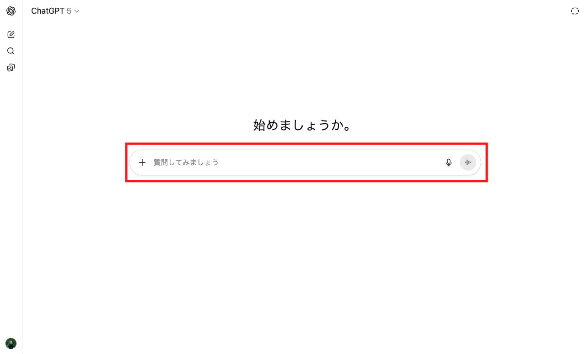

# 📗 Level 2: 高度機能テキスト

## 第5章: 検索・ツール活用

## ChatGPT研修内容：ウェブ検索・Deep Research活用

### 5-1 ウェブ検索・Deep Research活用

| 項目 | 内容 |
|------|------|
| **学習目標** | リアルタイム情報検索と高度な調査研究技術習得 |
| **対象機能** | ウェブ検索機能、Deep Research |

#### 📚 この章で学ぶこと

🌐 **ウェブ検索とDeep Researchの革新性**

ChatGPTの検索機能は、従来の情報収集を大幅に効率化します。単なる検索ではなく、情報の理解と統合を同時に実現します。リアルタイム情報検索と包括的な調査レポート作成の両方を習得し、ビジネスに必要な情報収集スキルを学びます。

🌐 **ウェブ検索機能**

ウェブ検索機能は、リアルタイムの情報を検索し、その内容を理解・要約して提供する機能です。最新のニュース、市場動向、競合情報などを即座に収集・分析できます。使い方としては、形式的にはツールセレクターからウェブ検索を選択することも可能ですが、通常はChatGPTが自動で検索の必要性を判別するため、特に設定は不要です。



**活用シーン**

次のようなシーンで効果的に活用できます。ターゲット情報を明確化（時期指定、地域・市場の特定、業界・競合他社の指定）し、信頼性の高いソース（官公庁発表、上場企業のIR情報、学術論文等）を優先し、複数ソースでの情報の交差検証を行うことが重要です。

- **競合分析**: 最新の製品リリース、価格変更、戦略発表
- **市場動向**: 消費者トレンド、規制変更、技術革新
- **事業機会**: 新しい市場、パートナーシップ、補助金情報

🔬 **Deep Research機能**

Deep Research機能は、特定のテーマについて複数の信頼できる情報源から包括的な情報を収集し、構造化されたレポートを作成する高度な調査ツールです。通常20-30ページに及ぶ詳細な分析レポートを自動生成し、複数段階での情報収集プロセスを経て信頼性の高いソース優先の検索を実行します。使い方はツールセレクターでDeep Researchを指定する必要があります。


詳細な調査設計について聞かれるので適宜回答してください。


その後レポートが作成されますが、PDF、Word、ウェブベースでのリンク共有も可能です。


**活用シーン**

調査テーマを具体的かつ焦点を絞って設定し、調査の目的と期待する成果物を明確に指定することで、特定の業界や地域にフォーカスした詳細な分析が可能になります。

- **市場分析**: 新規事業の可能性調査、業界動向の包括的な分析
- **競合分析**: 複数競合他社の戦略比較、差別化ポイントの明確化
- **技術調査**: 新技術の導入可能性、ロードマップの作成

#### ハンズオン演習

> 💡 **演習の進め方**
>
> 1. 各演習の状況設定を理解する
> 2. 記載されているプロンプト例をそのまま試す
> 3. 出力結果を確認し、より良い結果を得るためにプロンプトを修正します
> 4. 演習1〜3まで完了後、ユースケース例を参考に自業務での活用を検討してください

**【演習1】**

| テーマ | 状況設定 |
|------|------|
| ウェブ検索活用 - 競合他社の最新動向調査 | 明日の経営会議で競合他社の最新動向を報告する必要がある |

**プロンプト例**:
```
特に以下の点に注目：
- 新製品・サービスの発表
- 経営戦略の変更
- 人事異動（役員クラス）
- 業績発表

情報源の信頼性と日付を明記して、時系列で整理してください。

2024年10月以降の「株式会社〇〇」に関する最新ニュースを検索してください。
```

[プレースホルダー：ウェブ検索実行画面と検索結果の表示例]

**【演習2】**

| テーマ | 状況設定 |
|------|------|
| Deep Research活用 - 市場分析レポート作成 | 新規事業立ち上げのため、詳細な市場分析が必要 |

**プロンプト例**:
```
調査テーマ
「日本のヘルスケアアプリ市場の現状と将来展望（2024-2027年）」

調査目的
自社の新規ヘルスケアアプリ開発の事業計画策定

重点調査項目
1. 市場規模と成長率予測
2. 主要プレイヤーとそのシェア
3. ユーザー層の分析（年代別・用途別）
4. 成功事例と失敗事例の分析
5. 規制環境と今後の政策動向
6. 技術トレンド（AI活用、ウェアラブル連携等）
```


**【演習3】**

| テーマ | 状況設定 |
|------|------|
| Deep Research活用 - OpenAI商談情報調査 | OpenAIとの商談を成功させるための包括的な情報収集が必要 |

**プロンプト例**:
```
調査テーマ
「OpenAIについて商談する際に必要な情報を網羅的に調べて」

調査目的
OpenAIとの商談を成功させるために必要な包括的な情報収集

重点調査項目
1. OpenAIの企業概要と事業戦略
2. 主要製品・サービス（GPT-4、API、ChatGPT等）
3. 競合他社との位置づけと差別化要因
4. 料金体系とライセンス形態
5. パートナーシップ戦略と提携条件
6. 技術的な制限事項と利用規約
```

**ユースケース例**：自業務への応用（テーマ別 × 各3例）

学習した内容を次も参考に自業務に生かしてください。

**最新情報の要点収集**：
- ニュース要約と出典リンクの整理
- 重要キーワード監視と週次まとめ
- 法規・ガイドライン改定の確認

**比較・評価の標準化**：
- 競合/製品比較表の項目定義
- 価格/機能の差分抽出と要点化
- 長所短所と推奨シナリオ提示

**提案/資料づくりの下ごしらえ**：
- 参考事例の抜粋と引用管理
- 図表リンク収集と貼り付け形式の指定
- 背景調査の脚注ドラフト作成

### 5-2 コネクタ連携

| 項目 | 内容 |
|------|------|
| **学習目標** | 外部システム連携技術習得 |
| **対象機能** | コネクタ（Outlook、Outlook Calendar、OneDrive、SharePoint） |

#### 📚 この章で学ぶこと

🔗 **コネクタ連携の革新性**

コネクタとは、ChatGPTと組織が既に利用している外部サービス（メール、カレンダー、ファイルストレージなど）を連携させるための機能です。Microsoft 365のOutlook、OneDrive、SharePointやGoogle WorkspaceのGmail、Google Driveなど、様々なビジネスツールとChatGPTを接続できます。これらのコネクタは、組織の管理者が事前に設定・許可することで利用可能になり、個々のユーザーは管理者が有効化したコネクタの中から必要なものを選んで使用できます。

この連携により、ChatGPTは組織の情報資産に直接アクセスし、メールの検索、ファイルの要約、スケジュールの確認など、日常業務で必要な情報を横断的に取得・分析できるようになります。

**使い方**：

検索機能での利用時は、ツールセレクターからコネクタを選択します。これにより、選択したコネクタ（例：OneDrive、Outlook等）内の情報を直接検索できるようになります。

  

Deep Researchでの利用時は、まずツールセレクターでDeep Researchを選択し、その後、情報源として利用するコネクタを選択します。複数のコネクタを同時に選択することで、横断的な調査レポートの作成が可能です。


🔧 **MCPによる連携の仕組み**

ChatGPTがこれらの外部ツールと連携できるのは、**Model Context Protocol (MCP)** という技術基盤があるためです。

MCPは、かんたんに言うと「AIといろんなサービスをつなぐための共通の差し込み口」です。

たとえば、あなたがChatGPTに「来週の予定を教えて」とお願いするとします。ChatGPTは自分だけではカレンダーを見れません。そこで、MCPを使うとGoogleカレンダーやメール、Slackなどと安全につなぐケーブルを差し込めるようになります。


**図の意味**：
- **MCP hosts** → ChatGPTやClaudeなど、AIの"本体"
- **MCP clients** → AIと外部サービスをつなぐための"コントローラー"
- **MCP servers** → GmailやSlackなど、つなぎたいサービスの入り口
- **Remote services / Local data** → 実際のデータ（インターネット上や自分のPCの中）

💡 MCPは「AI用のマルチタップ電源」みたいなもので、差し込むアダプター（MCPサーバー）を変えるだけで、いろんなサービスとつながります。これによってAIは必要な情報を直接取りに行ったり、外部のサービスを使えるようになります。

📊 **利用可能なコネクタ一覧**

ビジネスで活用できる主要なコネクタと、それぞれの特性・活用方法を理解します。

| コネクタ名 | 主な用途 | 検索可能な内容 |
|----------|---------|--------------|
| **Outlook** | メール検索・分析 | 送受信メール、添付ファイル、連絡先情報 |
| **Outlook Calendar** | スケジュール分析 | 会議予定、出席者、場所、議題 |
| **OneDrive** | ファイル検索・要約 | Word、Excel、PowerPoint、PDF等の文書 |
| **SharePoint** | 組織文書検索 | チームサイト内の共有文書、Wiki、リスト |
| **Google Drive** | Googleファイル検索 | Docs、Sheets、Slides、共有ドライブ |
| **Gmail** | Googleメール検索 | 送受信メール、ラベル、スレッド |
| **Dropbox** | クラウドファイル検索 | 各種ファイル、共有フォルダ |
| **Box** | エンタープライズファイル | 業務文書、コラボレーションファイル |
| **Notion** | ナレッジベース検索 | ページ、データベース、Wiki |
| **GitHub** | コード・ドキュメント検索 | リポジトリ、Issues、Pull Requests |

#### ハンズオン演習

> 💡 **演習の進め方**
>
> 1. 各演習の状況設定を理解する
> 2. 記載されているプロンプト例をそのまま試す
> 3. 出力結果を確認し、より良い結果を得るためにプロンプトを修正します
> 4. 演習1〜3まで完了後、ユースケース例を参考に自業務での活用を検討してください
 ※組織で利用可能なコネクタにより実践できるケースは異なります。以下の演習は代表的な例として、自組織で有効なコネクタに置き換えて実施してください。

**【演習1】検索機能の活用**

| テーマ | 状況設定 |
|------|------|
| OneDrive検索 - 最近更新したファイルの確認 | 過去1週間に更新したファイルを把握したい |

**プロンプト例**:
```
OneDriveから過去1週間に更新されたファイルの名前を抽出してください。
更新日時の新しい順に並べて、ファイル形式（Word、Excel、PowerPoint等）も含めて一覧にしてください。
```

**【演習2】検索機能の活用**

| テーマ | 状況設定 |
|------|------|
| SharePoint検索 - 社内規定の検索 | 年次有給休暇の取得に関する規定を確認したい |

**プロンプト例**:
```
SharePointから年次有給休暇（年休）の取得に関する規定を検索してください。
「有給休暇」「年休」「休暇取得」をキーワードに、就業規則や人事規定から該当箇所を抽出してください。
特に取得条件、申請方法、繰越規定について詳しく教えてください。
```

**【演習3】Deep Research機能の活用**

| テーマ | 状況設定 |
|------|------|
| Outlook Deep Research - 週次メール分析 | 過去1週間のメールを分析して業務状況を把握したい |

**プロンプト例**:
```
# Deep Research依頼

## 調査テーマ
「過去1週間のメールコミュニケーション分析」

## 調査内容
- 過去1週間（月曜日から今日まで）の受信・送信メールを分析
- 主要な連絡先とやり取りの頻度
- 重要なトピックと未対応事項の整理
- 緊急度の高いメールの特定

## 期待する成果物
週次メール分析レポートと優先対応すべきタスクリスト
```

**ユースケース例**：自業務への応用（テーマ別 × 各3例）

学習した内容を次も参考に自業務に生かしてください。

**メール・日程の整理**：
- 週次メール要点と未対応抽出
- 会議招集と事前資料の自動まとめ
- フォローアップのToDo化と期限付与

**ファイル/ナレッジ活用**：
- 規程・手順書の該当箇所検索
- 最新版/改訂履歴の確認
- 関連資料の横断要約

**CRM/タスク連携**：
- 顧客ごとの履歴集約と要点化
- 次アクションと期日の自動提案
- 定期レポートのテンプレ化
