# 📗 Level 2: 高度機能テキスト
**対象**: Level 2受講者

## 第5章: 検索・ツール活用

## ChatGPT研修内容：ウェブ検索・Deep Research活用

### 5-1 ウェブ検索・Deep Research活用

| 項目 | 内容 |
|------|------|
| **学習目標** | リアルタイム情報検索と高度な調査研究技術習得 |
| **対象機能** | ウェブ検索機能、Deep Research |

#### 📚 この章で学ぶこと

🌐 **ウェブ検索とDeep Researchの革新性**

ChatGPTの検索機能は、従来の情報収集を大幅に効率化します。単なる検索ではなく、情報の理解と統合を同時に実現します。リアルタイム情報検索と包括的な調査レポート作成の両方を習得し、ビジネスに必要な情報収集スキルを学びます。

🌐 **ウェブ検索機能**

ウェブ検索機能は、リアルタイムの情報を検索し、その内容を理解・要約して提供する機能です。最新のニュース、市場動向、競合情報などを即座に収集・分析できます。使い方としては、形式的にはツールセレクターからウェブ検索を選択することも可能ですが、通常はChatGPTが自動で検索の必要性を判別するため、特に設定は不要です。

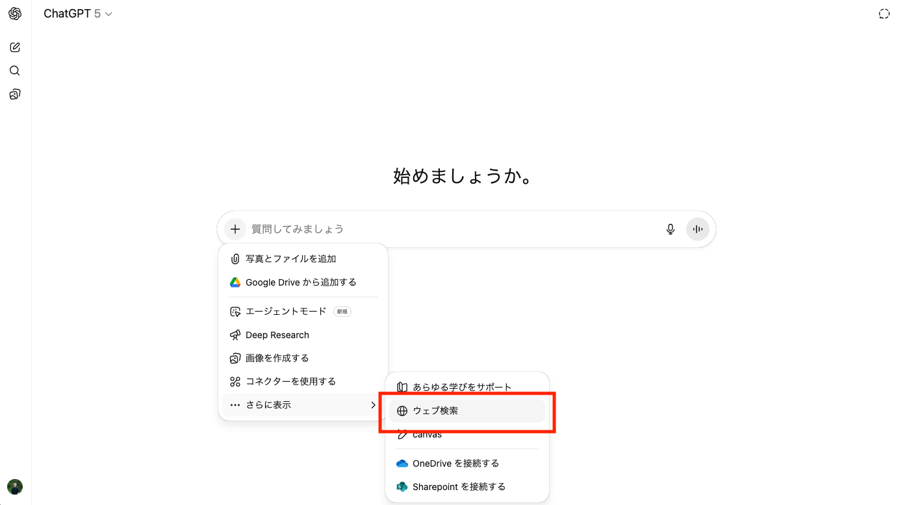  

**活用シーン**

次のようなシーンで効果的に活用できます。ターゲット情報を明確化（時期指定、地域・市場の特定、業界・競合他社の指定）し、信頼性の高いソース（官公庁発表、上場企業のIR情報、学術論文等）を優先し、複数ソースでの情報の交差検証を行うことが重要です。

- **競合分析**: 最新の製品リリース、価格変更、戦略発表
- **市場動向**: 消費者トレンド、規制変更、技術革新
- **事業機会**: 新しい市場、パートナーシップ、補助金情報

🔬 **Deep Research機能**

Deep Research機能は、特定のテーマについて複数の信頼できる情報源から包括的な情報を収集し、構造化されたレポートを作成する高度な調査ツールです。通常20-30ページに及ぶ詳細な分析レポートを自動生成し、複数段階での情報収集プロセスを経て信頼性の高いソース優先の検索を実行します。使い方はツールセレクターでDeep Researchを指定する必要があります。


詳細な調査設計について聞かれるので適宜回答してください。


その後レポートが作成されますが、PDF、Word、ウェブベースでのリンク共有も可能です。


**活用シーン**

調査テーマを具体的かつ焦点を絞って設定し、調査の目的と期待する成果物を明確に指定することで、特定の業界や地域にフォーカスした詳細な分析が可能になります。

- **市場分析**: 新規事業の可能性調査、業界動向の包括的な分析
- **競合分析**: 複数競合他社の戦略比較、差別化ポイントの明確化
- **技術調査**: 新技術の導入可能性、ロードマップの作成

#### ハンズオン演習

> 
> 💡 **演習の進め方**
>
> 1. 各演習の状況設定を理解する
> 2. 記載されているプロンプト例をそのまま試す
> 3. 出力結果を確認し、より良い結果を得るためにプロンプトを修正します
> 4. 演習1〜3まで完了後、ユースケース例を参考に自業務での活用を検討してください
> 

**【演習1】**

| テーマ | 状況設定 |
|------|------|
| ウェブ検索活用 - 競合他社の最新動向調査 | 明日の経営会議で競合他社の最新動向を報告する必要がある |

**プロンプト例**:
```
特に以下の点に注目：
- 新製品・サービスの発表
- 経営戦略の変更
- 人事異動（役員クラス）
- 業績発表

情報源の信頼性と日付を明記して、時系列で整理してください。

2024年10月以降の「株式会社〇〇」に関する最新ニュースを検索してください。
```

[プレースホルダー：ウェブ検索実行画面と検索結果の表示例]

**【演習2】**

| テーマ | 状況設定 |
|------|------|
| Deep Research活用 - 市場分析レポート作成 | 新規事業立ち上げのため、詳細な市場分析が必要 |

**プロンプト例**:
```
調査テーマ
「日本のヘルスケアアプリ市場の現状と将来展望（2024-2027年）」

調査目的
自社の新規ヘルスケアアプリ開発の事業計画策定

重点調査項目
1. 市場規模と成長率予測
2. 主要プレイヤーとそのシェア
3. ユーザー層の分析（年代別・用途別）
4. 成功事例と失敗事例の分析
5. 規制環境と今後の政策動向
6. 技術トレンド（AI活用、ウェアラブル連携等）
```


**【演習3】**

| テーマ | 状況設定 |
|------|------|
| Deep Research活用 - OpenAI商談情報調査 | OpenAIとの商談を成功させるための包括的な情報収集が必要 |

**プロンプト例**:
```
調査テーマ
「OpenAIについて商談する際に必要な情報を網羅的に調べて」

調査目的
OpenAIとの商談を成功させるために必要な包括的な情報収集

重点調査項目
1. OpenAIの企業概要と事業戦略
2. 主要製品・サービス（GPT-4、API、ChatGPT等）
3. 競合他社との位置づけと差別化要因
4. 料金体系とライセンス形態
5. パートナーシップ戦略と提携条件
6. 技術的な制限事項と利用規約
```

**ユースケース例**：自業務への応用

学習した内容を次も参考に自業務に生かしてください。

```
**営業部門の例**：
- 競合他社の最新動向リアルタイム調査
- 業界トレンド分析と市場機会発掘
- 顧客業界の最新ニュースと提案機会との連動

**企画部門の例**：
- 新サービスの市場性調査と競合分析
- 技術トレンドと新技術の導入可能性調査
- 海外市場参入機会の詳細調査

**マーケティング部門の例**：
- ターゲット市場の消費者トレンド分析
- 競合他社のマーケティング施策と効果測定
- 新商品ローンチ時の市場反応と競合対応分析
```

### 5-2 コネクタ連携

| 項目 | 内容 |
|------|------|
| **学習目標** | 外部システム連携技術習得 |
| **対象機能** | コネクタ（Outlook、Outlook Calendar、OneDrive、SharePoint） |

#### 📚 この章で学ぶこと

🔗 **コネクタ連携の革新性**

コネクタとは、ChatGPTと組織が既に利用している外部サービス（メール、カレンダー、ファイルストレージなど）を連携させるための機能です。Microsoft 365のOutlook、OneDrive、SharePointやGoogle WorkspaceのGmail、Google Driveなど、様々なビジネスツールとChatGPTを接続できます。これらのコネクタは、組織の管理者が事前に設定・許可することで利用可能になり、個々のユーザーは管理者が有効化したコネクタの中から必要なものを選んで使用できます。

この連携により、ChatGPTは組織の情報資産に直接アクセスし、メールの検索、ファイルの要約、スケジュールの確認など、日常業務で必要な情報を横断的に取得・分析できるようになります。

**使い方**：

検索機能での利用時は、ツールセレクターからコネクタを選択します。これにより、選択したコネクタ（例：OneDrive、Outlook等）内の情報を直接検索できるようになります。

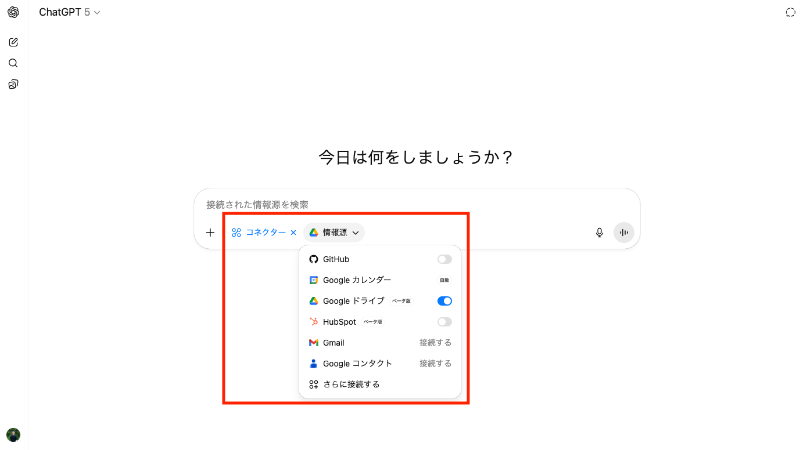  

Deep Researchでの利用時は、まずツールセレクターでDeep Researchを選択し、その後、情報源として利用するコネクタを選択します。複数のコネクタを同時に選択することで、横断的な調査レポートの作成が可能です。


🔧 **MCPによる連携の仕組み**

ChatGPTがこれらの外部ツールと連携できるのは、**Model Context Protocol (MCP)** という技術基盤があるためです。

MCPは、かんたんに言うと「AIといろんなサービスをつなぐための共通の差し込み口」です。

たとえば、あなたがChatGPTに「来週の予定を教えて」とお願いするとします。ChatGPTは自分だけではカレンダーを見れません。そこで、MCPを使うとGoogleカレンダーやメール、Slackなどと安全につなぐケーブルを差し込めるようになります。


**図の意味**：
- **MCP hosts** → ChatGPTやClaudeなど、AIの"本体"
- **MCP clients** → AIと外部サービスをつなぐための"コントローラー"
- **MCP servers** → GmailやSlackなど、つなぎたいサービスの入り口
- **Remote services / Local data** → 実際のデータ（インターネット上や自分のPCの中）

💡 MCPは「AI用のマルチタップ電源」みたいなもので、差し込むアダプター（MCPサーバー）を変えるだけで、いろんなサービスとつながります。これによってAIは必要な情報を直接取りに行ったり、外部のサービスを使えるようになります。

📊 **利用可能なコネクタ一覧**

ビジネスで活用できる主要なコネクタと、それぞれの特性・活用方法を理解します。

| コネクタ名 | 主な用途 | 検索可能な内容 |
|----------|---------|--------------|
| **Outlook** | メール検索・分析 | 送受信メール、添付ファイル、連絡先情報 |
| **Outlook Calendar** | スケジュール分析 | 会議予定、出席者、場所、議題 |
| **OneDrive** | ファイル検索・要約 | Word、Excel、PowerPoint、PDF等の文書 |
| **SharePoint** | 組織文書検索 | チームサイト内の共有文書、Wiki、リスト |
| **Google Drive** | Googleファイル検索 | Docs、Sheets、Slides、共有ドライブ |
| **Gmail** | Googleメール検索 | 送受信メール、ラベル、スレッド |
| **Dropbox** | クラウドファイル検索 | 各種ファイル、共有フォルダ |
| **Box** | エンタープライズファイル | 業務文書、コラボレーションファイル |
| **Notion** | ナレッジベース検索 | ページ、データベース、Wiki |
| **GitHub** | コード・ドキュメント検索 | リポジトリ、Issues、Pull Requests |

#### ハンズオン演習

> 
> 💡 **演習の進め方**
>
> 1. 各演習の状況設定を理解する
> 2. 記載されているプロンプト例をそのまま試す
> 3. 出力結果を確認し、より良い結果を得るためにプロンプトを修正します
> 4. 演習1〜3まで完了後、ユースケース例を参考に自業務での活用を検討してください
> 
 ※組織で利用可能なコネクタにより実践できるケースは異なります。以下の演習は代表的な例として、自組織で有効なコネクタに置き換えて実施してください。

**【演習1】検索機能の活用**

| テーマ | 状況設定 |
|------|------|
| OneDrive検索 - 最近更新したファイルの確認 | 過去1週間に更新したファイルを把握したい |

**プロンプト例**:
```
OneDriveから過去1週間に更新されたファイルの名前を抽出してください。
更新日時の新しい順に並べて、ファイル形式（Word、Excel、PowerPoint等）も含めて一覧にしてください。
```

**【演習2】検索機能の活用**

| テーマ | 状況設定 |
|------|------|
| SharePoint検索 - 社内規定の検索 | 年次有給休暇の取得に関する規定を確認したい |

**プロンプト例**:
```
SharePointから年次有給休暇（年休）の取得に関する規定を検索してください。
「有給休暇」「年休」「休暇取得」をキーワードに、就業規則や人事規定から該当箇所を抽出してください。
特に取得条件、申請方法、繰越規定について詳しく教えてください。
```

**【演習3】Deep Research機能の活用**

| テーマ | 状況設定 |
|------|------|
| Outlook Deep Research - 週次メール分析 | 過去1週間のメールを分析して業務状況を把握したい |

**プロンプト例**:
```
# Deep Research依頼

## 調査テーマ
「過去1週間のメールコミュニケーション分析」

## 調査内容
- 過去1週間（月曜日から今日まで）の受信・送信メールを分析
- 主要な連絡先とやり取りの頻度
- 重要なトピックと未対応事項の整理
- 緊急度の高いメールの特定

## 期待する成果物
週次メール分析レポートと優先対応すべきタスクリスト
```

**ユースケース例**：自業務への応用

学習した内容を次も参考に自業務に生かしてください。

```
**プロジェクト管理部門の例**：
- 過去プロジェクト資料からのベストプラクティス抽出
- プロジェクト成果物の体系的な検索と整理
- ステークホルダーとのコミュニケーション履歴分析

**人事部門の例**：
- 研修資料の体系的な管理と活用
- 社内ナレッジの集約と新人研修への応用
- 従業員アンケート結果の分析と改善提案

**営業部門の例**：
- 顧客とのメール履歴からの関係性分析
- 提案書テンプレートの検索と活用
- 成功事例の横断検索とナレッジ共有
```


## 第6章: キャンバス機能

### 6-1 Canvas文書編集

| 項目 | 内容 |
|------|------|
| **学習目標** | Canvas機能を使った文書作成・編集技術習得 |
| **対象機能** | Canvas（文書編集） |

#### 📚 この章で学ぶこと

🖊️ **Canvas文書編集機能の革新性**

Canvas機能は、ChatGPTと協働しながらリアルタイムで文書を作成・編集できる革新的なワークスペースです。従来の「質問→回答」形式を超えて、インタラクティブな文書作成を実現します。部分選択編集、ショートカットメニュー、リアルタイム協働の高度機能を習得します。

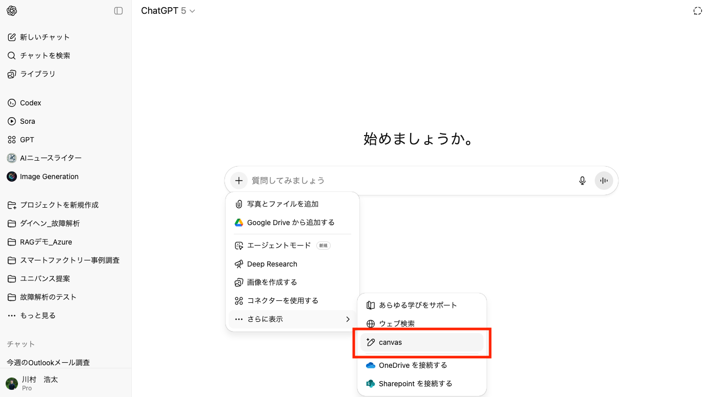

📝 **Canvas文書編集の主要機能**

従来の文書作成ツールを超える3つの革新的機能と、その実用的な活用方法を学びます。

1. **部分選択編集・リライト**
   - 修正したい箇所だけを選択し、その部分だけを再生成・リライトが可能
   - 文章全体が書き換わるのではなく、ピンポイントで編集可能
   - 特定の段落や文章の改善に最適

   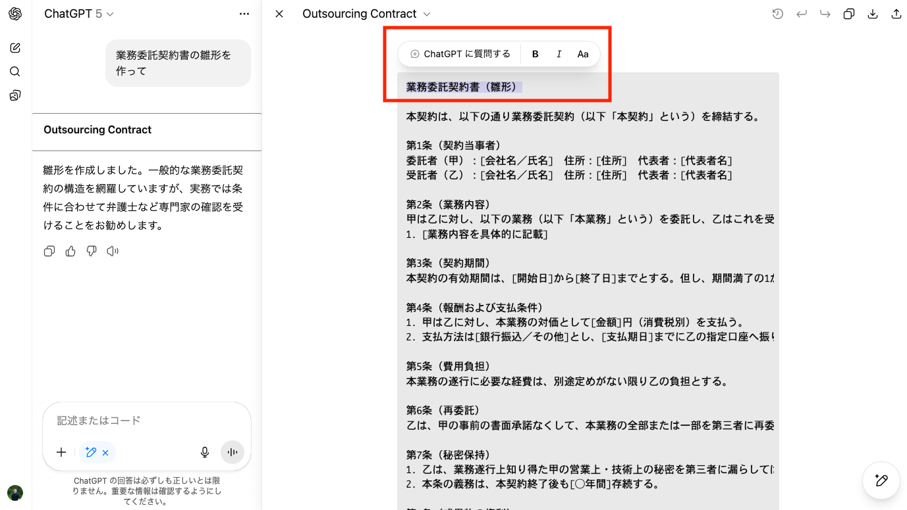
2. **ショートカットメニュー（ツールボタン）**
   右下の鉛筆マークなどで編集ショートカットが利用できます：
   - **絵文字の追加**: 簡単に文章へ絵文字を挿入
   - **最終仕上げ**: AIによる文法チェックや構成改善
   - **読解レベル調整**: 幼稚園〜大学院レベルなど分かりやすさを段階ごとに調整
   - **長さ調整**: 「もっと長く」「もっと短く」などワンクリックで文字数調整
   - **編集提案**: AIが改善点や修正案を提示、そのまま適用することも可能

   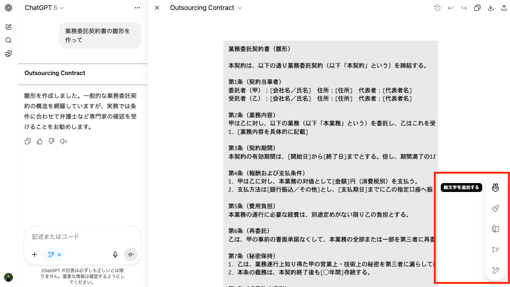

3. **リアルタイム協働編集**
   - ChatGPTが文書の改善提案をリアルタイムで実施
   - 文書構成の論理性チェックと改善案提示
   - トーン＆マナーの一貫性保持
   - 作成した文書のダウンロード（PDF、Word形式等）

   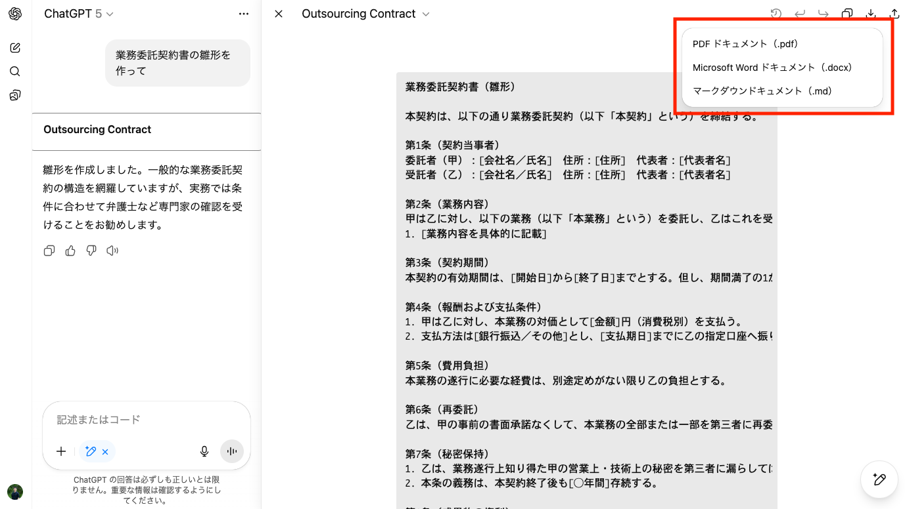


#### ハンズオン演習

> 
> 💡 **演習の進め方**
>
> 1. 各演習の状況設定を理解する
> 2. 記載されているプロンプト例をそのまま試す
> 3. 出力結果を確認し、より良い結果を得るためにプロンプトを修正します
> 4. 演習1〜3まで完了後、ユースケース例を参考に自業務での活用を検討してください
> 

**【演習1】**

| テーマ | 状況設定 |
|------|------|
| ブログ記事執筆 - 商品紹介記事の作成 | 自社の新商品を紹介するブログ記事を作成する |

**プロンプト例**:
```
新発売の健康志向スナック「玄米クッキー」のブログ記事を書いてください。
- タイトルも含めて1000文字程度
- ターゲット：健康意識の高い30-40代女性
- 特徴：国産玄米使用、砂糖不使用、食物繊維豊富
- 価格：500円（税込）
読みやすく親しみやすい文章でお願いします。
```


**【演習2】**

| テーマ | 状況設定 |
|------|------|
| 業務報告書作成 - 月次売上報告書 | 上司向けに今月の売上実績を報告する文書を作成する |

**プロンプト例**:
```
3月の売上実績報告書を作成してください。
含める内容：
- 今月の売上実績：1,200万円（目標1,000万円）
- 好調だった商品：ヘルスケア商品（前月比150%）
- 課題：新規顧客獲得が目標の80%
- 来月の改善策
A4用紙1枚程度で、上司が読みやすい形式でお願いします。
```


**【演習3】**

| テーマ | 状況設定 |
|------|------|
| プレゼンテーション資料作成 - 新規企画提案 | 社内向けに新しい企画を提案する資料を作成する |

**プロンプト例**:
```
社内カフェ設置の企画提案書を作成してください。
- 提案背景：社員の満足度向上、コミュニケーション活性化
- 設置場所：1階ロビー
- 予算：初期費用300万円、月次運営費50万円
- 期待効果：社員満足度向上、来客対応の改善
- 実施スケジュール：3ヶ月で準備・オープン
経営陣が読みやすい構成でお願いします。
```


**ユースケース例**：自業務への応用

学習した内容を次も参考に自業務に生かしてください。

```
**マーケティング部門の例**：
- ブログ記事やSNS投稿の効率的な作成と最適化
- プレスリリースや広告文の作成と復数パターン作成
- キャンペーン資料のコンセプトから詳細資料まで一気通貫作成

**経営企画部門の例**：
- 事業計画書や企画提案書の構造化された作成
- 市場分析レポートの要約から詳細分析まで
- ステークホルダー向け資料のトーン調整と最適化

**人事部門の例**：
- 研修資料やマニュアルの体系的な作成と更新
- 社内ニュースレターや告知文の効率的な作成
- 採用関連資料の統一性を保った作成
```

### 6-2 Canvasコード編集（選択）

| 項目 | 内容 |
|------|------|
| **学習目標** | Canvas機能を使ったコード開発技術習得 |
| **対象機能** | Canvas（コード編集） |

#### 📚 この章で学ぶこと

💻 **Canvasコード編集機能の特徴**

プログラミング経験がなくても、ChatGPTとの対話を通じて実用的なコードを作成・改善できます。コードの自動生成から最適化、デバッグまで包括的にサポートします。Canvas機能でコードを書いてもらったら、「コードを実行」ボタンを押すことでコードが実行されます。ただし、JavaScriptやPythonなど実行環境が複雑なものは表示できません。基本的にはフロントエンド（HTML、CSS、JavaScriptでブラウザ上で動作するもの）がメインとなります。作成したコードはダウンロードして自社環境で公開することもできます。

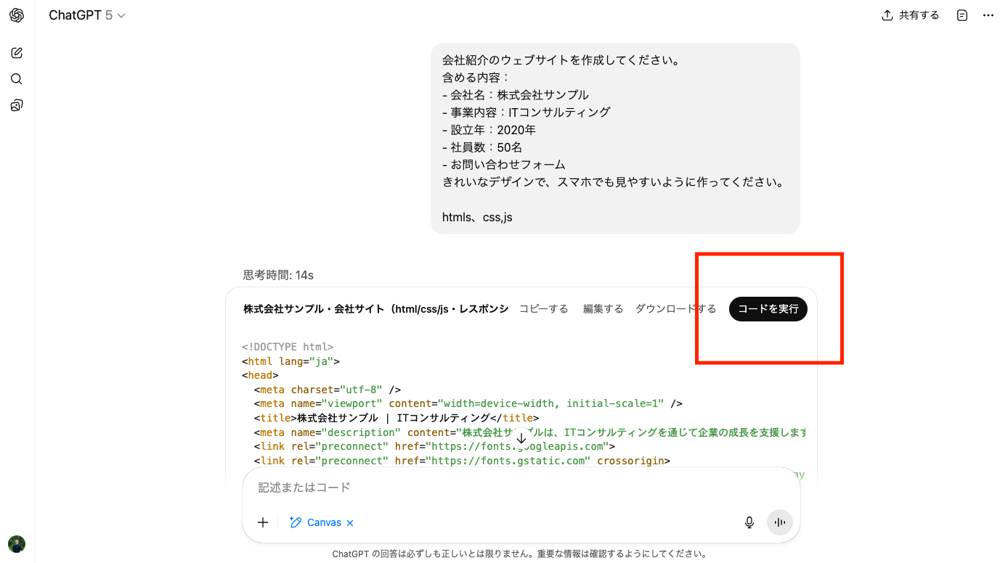

仕上がりイメージ：
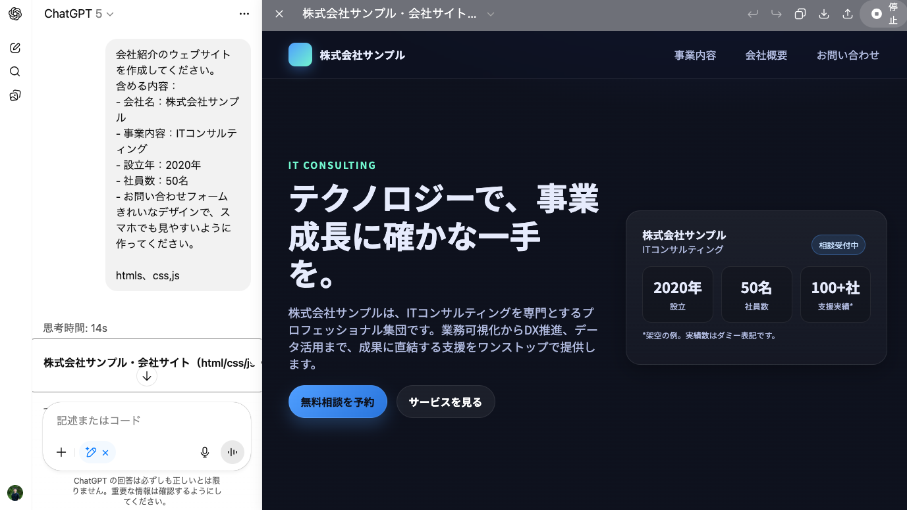

🛠️ **主要なコード編集機能**

Canvasのコード編集では、右側のツールバーから様々な編集支援機能を利用できます。これらの機能により、コードの品質向上やデバッグ、他言語への変換などが簡単に実行できます。

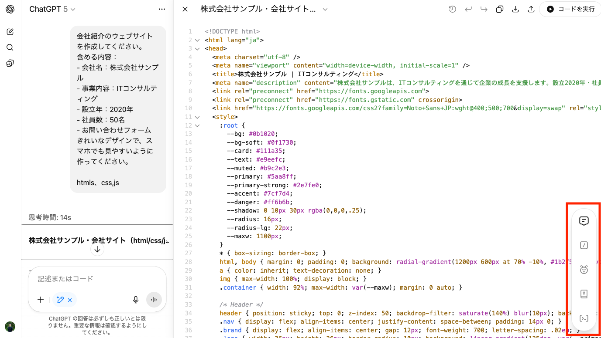

| 機能名 | 何をやってくれる？ | 典型的な使いどころ |
|--------|------------------|-------------------|
| Code review | 行ごとにインラインコメントを付けてリファクタや最適化案を提案。Applyを押すと自動反映できます | 可読性・パフォーマンスを第三者レビュー感覚でチェックしたい時 |
| Add comments | 変数や関数の意図を説明するコメント行を自動挿入。ドキュメント整備を一気に済ませられます | チームに共有する前に「読みやすいコード」にしたい時 |
| Fix bugs | 解析してバグになりそうな箇所を検出し、修正版コードに置き換え。Pythonならその場で実行して再テストも可能 | エラー原因が掴めず「まず動く状態」に戻したい時 |
| Port to a language | 現在のスクリプトを別言語（JavaScript/TypeScript/Python/Java/C++/PHPなど）へ丸ごと変換 | 同じロジックを他スタックへ移植したい時や学習用に比較したい時 |

🎯 **非プログラマーでも活用できるポイント**

プログラミング経験がなくても、以下の手順で実用的なWebアプリケーションを作成できます。自然言語での指示から始めて、段階的に改善していくアプローチが効果的です。

```
1. 自然言語での指示: 「Excelファイルを読み込んで集計する」のような日本語指示でOK
2. 段階的な改善: まず動くコードを作り、その後「もっと速く」「エラー処理を追加」など改善
3. コメント重視: Add commentsで処理内容を日本語で理解
4. エラー時の対処: Fix bugsで自動修正、理解できないエラーも解決
```

#### ハンズオン演習

> 
> 💡 **演習の進め方**
>
> 1. 各演習の状況設定を理解する
> 2. 記載されているプロンプト例をそのまま試す
> 3. 出力結果を確認し、より良い結果を得るためにプロンプトを修正します
> 4. 演習1〜3まで完了後、ユースケース例を参考に自業務での活用を検討してください
> 

**【演習1】**

| テーマ | 状況設定 |
|------|------|
| シンプルなウェブサイト制作 - 会社紹介ページ | 自社の簡単な紹介ウェブサイトを作成したい |

**プロンプト例**:
```
会社紹介のウェブサイトを作成してください。
含める内容：
- 会社名：株式会社サンプル
- 事業内容：ITコンサルティング
- 設立年：2020年
- 社員数：50名
- お問い合わせフォーム
きれいなデザインで、スマホでも見やすいように作ってください。
```


**【演習2】**

| テーマ | 状況設定 |
|------|------|
| タスク管理アプリ制作 - ToDoリスト | 個人用の簡単なタスク管理アプリを作りたい |

**プロンプト例**:
```
シンプルなタスク管理アプリを作成してください。
機能：
- タスクの追加
- タスクの完了チェック
- タスクの削除  
- 完了済みタスクの表示/非表示切り替え
HTMLとJavaScriptで作成し、ブラウザで動くようにしてください。
```


**【演習3】**

| テーマ | 状況設定 |
|------|------|
| 簡単なゲーム制作 - 数当てゲーム | 友人と楽しめる簡単なゲームを作りたい |

**プロンプト例**:
```
1から100までの数字を当てる数当てゲームを作成してください。
ルール：
- コンピューターがランダムに数字を選ぶ
- プレイヤーが数字を入力
- 「もっと大きい」「もっと小さい」「正解！」でヒント
- 試行回数を表示
- ゲーム終了後にもう一度遊べる
HTML、CSS、JavaScriptで作成してください。
```


**ユースケース例**：自業務への応用

学習した内容を次も参考に自業務に生かしてください。

```
**システム開発部門の例**：
- プロトタイプやMVP版アプリの迅速な開発
- 既存システムの別言語への移植作業
- 社内ツールの自動化スクリプト作成

**企画部門の例**：
- プレゼン用のインタラクティブなデモサイト作成
- 簡単な計算ツールやシミュレーションアプリ開発
- 市場調査用の簡易アンケートシステム構築

**マーケティング部門の例**：
- ランディングページやキャンペーンサイトの作成
- 顧客体験向上のための簡易診断ツール開発
- ブランド体験を提供するミニゲームの制作
```


## 第7章: プロジェクト・カスタムGPT機能

### 7-1 プロジェクト作成

| 項目 | 内容 |
|------|------|
| **学習目標** | チーム協働のためのプロジェクト管理技術習得 |
| **対象機能** | プロジェクト機能 |

#### 📚 この章で学ぶこと

🗂️ **プロジェクト機能の革新性**

ChatGPT Teamのプロジェクト機能は、関連するチャット・ファイル・指示内容を「プロジェクト」単位で整理・保存できる個人向けワークスペースです。個別テーマごとに資料や設定を分離し、情報漏れや混乱を防ぐスマートフォルダとして機能します。

サイドバー左側からプロジェクトの設定画面に移動できます。

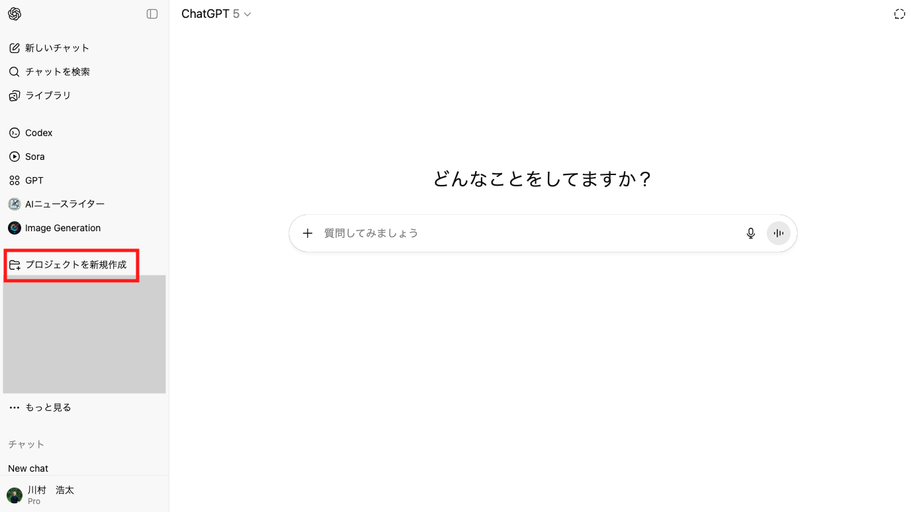

プロジェクトの編集画面では、左下の箇所からファイルアップロードが、右下の箇所からカスタムプロンプトを追加することができます。

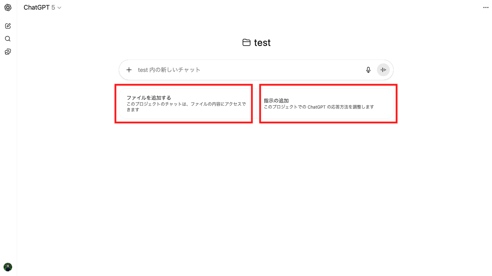

📊 **プロジェクト機能の主要特徴**

1. **テーマ別情報整理**
   - 関連するチャット・ファイル・指示を一箇所に集約
   - 個別テーマごとの資料管理と設定分離
   - 過去のやり取り・履歴を活かした継続的な作業

2. **多様なファイル対応**
   - PDF、Word、Excel、CSVなど様々な形式に対応
   - プロジェクトごとのファイルアップロードと参照
   - AIがファイル内容を理解した応答生成

3. **カスタム指示設定**
   - プロジェクトごとの独自指示設定（応答スタイル・役割定義）
   - 「丁寧語で答えて」「要点だけ簡潔に」等の細かな調整
   - 目的に応じたAIアシスタントの最適化

#### ハンズオン演習

> 
> 💡 **演習の進め方**
>
> 1. 各演習の状況設定を理解する
> 2. 記載されているプロンプト例をそのまま試す
> 3. 出力結果を確認し、より良い結果を得るためにプロンプトを修正します
> 4. 演習1〜3まで完了後、ユースケース例を参考に自業務での活用を検討してください
> 

**【演習1】**

| テーマ | 状況設定 |
|------|------|
| ファイル情報の検索 - AIニュースアーカイブプロジェクト | 複数のAIニュースガイドから必要な情報を効率的に検索したい |

※この演習では**指示（カスタムプロンプト）は使用しません**。ファイルアップロード機能のみを活用します。

**プロジェクトの設定内容**:

【静的ファイル（プロジェクトに保管）】
- ProFab_これさえ読めばわかる！2024年AIニュース完全ガイド  
  https://drive.google.com/file/d/1h-73GAxUDsoChbea6rafAdCzJ0y5UJYc/view?usp=sharing
- ProFab_これさえ読めばわかる！2025年1〜3月AIニュース完全ガイド  
  https://drive.google.com/file/d/1NBEQX7QBB5_R0mM6fn-qL29SwuXk8R13/view?usp=sharing
- 2025年1〜8月AIニュース完全ガイド  
  https://drive.google.com/file/d/16HYzLrcK7QhDEi5p0k2wEm6w0whgUgrs/view?usp=sharing

【指示（カスタムプロンプト）】
なし

**チャット時の操作**:

【プロンプト例1】
```
個別ファイルの概要を教えて
```

【プロンプト例2】
```
ProFab_これさえ読めばわかる！2024年AIニュース完全ガイドの内容を教えて
```

【プロンプト例3】
```
OpenAIのニュースを箇条書きにして
```


**【演習2】**

| テーマ | 状況設定 |
|------|------|
| 記事の段階的な執筆 - AIニュース解説記事の作成 | 最新のAIニュースを段階的なプロセスで解説記事にする |

※この演習では**ファイルアップロードは使用しません**。指示（カスタムプロンプト）機能のみを活用します。

**プロジェクトの設定内容**:

【静的ファイル（プロジェクトに保管）】
なし

【指示（カスタムプロンプト）】
```
このGPTは、最新のAI関連ニュースを解説する記事を作成する専門家として振る舞います。ユーザーが提供するニュース記事やトピックに基づき、それを一般の読者にもわかりやすい形で解説します。作業は以下の手順で進行します。

**1．ニュース記事の要約**
ユーザーからニュース記事が提供された場合、まずその内容を漏らさず要約します。主要なポイントを簡潔かつ明確に伝えることを重視します。
→ 要約後、ユーザーに内容を提示し、理解や方向性について**確認またはフィードバック**を受けます。

**2．章構成の提示**
ユーザーは記事の章構成を示します。この章構成は、ニュース記事の再構成と、最後のパートにニュースに対するユーザー個人の見解を含むものとします。タイトル、リード文も冒頭に含めてください。
→ 章構成提示後、ユーザーから**確認またはフィードバック**を受けます。

**3．本文作成**
ユーザーが提示した章構成に従い、Canvas機能を用いて記事本文を作成します。専門用語や技術的な内容は適切な例や比喻を用いて説明し、中立的な視点を保ちながら背景や重要性を強調します。リード文は本文をサマリーすることだけに留め、「〜について紹介します」「〜解説します」といった導入文は禁止します。「である調」は禁止し、「ですます調」にしてください。
→ 作成後、ユーザーから**確認またはフィードバック**を受けます。

**4．本文の微調整**
Canvasを利用して本文を微調整します。最終的に納得のいく形になるまで編集をサポートします。

---

トーンとスタイル

* 親しみやすく、教育的で、プロフェッショナル。
* 日本語の正確さを重視し、文法や語彙に配慮します。

注意点

* 質問が不明確な場合や情報が不足している場合は、必要に応じて追加情報を尋ねます。
* ニュースに対する分析コメントは簡潔かつ独自性を持たせます。
```

**チャット時の操作**:

【解説記事の対象ニュース】
```
GPT-5のご紹介  
https://openai.com/ja-JP/index/introducing-gpt-5/
```

【進め方】
上記の指示に従って、ChatGPTがステップごとに確認を求めてきます。基本的に問題がなければ「OK」と入力すると次のプロセスに進みます。調整が必要な場合は、必要に応じてフィードバックを入力してください。


**【演習3】**

| テーマ | 状況設定 |
|------|------|
| 契約書レビュー - ガイドラインに基づく契約書チェック | 契約書作成ガイドラインを基準に、ドラフト契約書の品質向上を図る |

**プロジェクトの設定内容**:

【静的ファイル（プロジェクトに保管）】
- 契約書作成ガイドライン（業務委託・請負）.docx  
  [contract_guideline.docx](../../sample/contract_guideline.docx)
- 契約書雛形ファイル  
  [contract_template.docx](../../sample/contract_template.docx)

【指示（カスタムプロンプト）】
```
あなたは契約書レビューアシスタントです。
アップロードされた契約書ドラフトに対し、保管されている「契約書作成ガイドライン（業務委託契約・請負契約）」を参照し、
以下を行ってください：
1. ガイドラインに照らして問題点や不足点を指摘
2. 指摘には該当するガイドラインの箇所番号を明示
3. 必要に応じて改善案を提示
```

**チャット時の操作**:

【レビュー対象ファイル（チャット時にアップロード）】
- 業務委託契約書（ドラフト）.docx  
  /sample/draft_contract.docx

【プロンプト例】
```
この契約書ドラフトをレビューしてください。ガイドラインに沿って指摘と改善案をお願いします。
```


**ユースケース例**：自業務への応用

学習した内容を次も参考に自業務に生かしてください。

```
**プロジェクト管理部門の例**：
- 複数プロジェクトの情報とナレッジの一元管理
- 段階的なプロジェクト検討の履歴保持と活用
- チーム内でのプロジェクト情報共有環境構築

**営業部門の例**：
- 顧客別の提案検討とブラッシュアップ環境
- 商談履歴と提案資料の統合管理
- 提案力向上のためのAI壁打ち活用

**マーケティング部門の例**：
- キャンペーン企画の段階的検討管理
- コンテンツ制作の品質向上ワークフロー
- 市場調査データと企画案の一元化
```

### 7-2 GPT作成基礎

| 項目 | 内容 |
|------|------|
| **学習目標** | カスタムGPT作成技術習得 |
| **対象機能** | カスタムGPT作成 |

#### 📚 この章で学ぶこと

🤖 **カスタムGPT機能の革新性**

カスタムGPT（GPTs）は、ChatGPTをユーザー自身のニーズや目的に合わせて**自由にカスタマイズし、オリジナルAIアシスタント（チャットボット）を簡単に作成できる機能**です。ノーコードで専門知識不要、直感的に設定できるのが最大の特徴です。

📋 **GPTのユースケース**

ChatGPTの「GPT」機能は、自分専用のAI（カスタムGPT）を作り、特定の用途に特化させて活用できる機能です。以下に代表的なユースケースをまとめます。

**1. 文章生成・コンテンツ制作**
* **記事・ブログの自動生成**：ニュース記事の要約やSEO向けブログ記事の執筆を自動化
* **広告コピー作成**：キャッチコピー、セールス文、SNS投稿文などをブランドトーンに合わせて生成
* **資料作成支援**：プレゼン資料や提案書の下書きを作成

**2. 業務支援・ドキュメント処理**
* **契約書レビューGPT**：アップロードした契約書をガイドラインに沿ってチェックし改善案を提示
* **議事録生成**：会議の音声やテキストを要約し、決定事項やアクションアイテムを抽出
* **FAQ回答ボット**：社内マニュアルや製品情報を読み込み、自然言語での問い合わせに即応

**3. データ分析・可視化**
* **売上分析GPT**：CSVやスプレッドシートを読み込み、グラフ化や傾向分析を実施
* **マーケティング効果測定**：広告費とコンバージョンの相関分析やレポート生成
* **アンケート分析**：テキスト回答の感情分析やトピック分類

**4. 学習・教育**
* **語学学習パートナー**：会話練習や作文添削、発音アドバイスを提供
* **試験対策GPT**：過去問や模擬問題の解説、学習プランの提案
* **社内研修支援**：社員向けに業務マニュアルやケーススタディを分かりやすく解説

**5. クリエイティブ制作**
* **画像生成補助**：プロンプト作成支援やキャプション提案
* **ストーリー作成**：小説・漫画・ゲームシナリオの共同制作
* **デザインレビュー**：提出されたデザイン案にフィードバック

📊 **プロジェクトとGPTの使い分け**

ChatGPTの**「プロジェクト」**と**「GPT（カスタムGPT）」**は、似ているようで役割がまったく違います。
ざっくり言うと **「プロジェクト＝会話やファイルの保存・継続利用の場」**、**「GPT＝特定の性格・知識・機能を持ったAI」** です。

**1. 概念の違い**

| 項目 | プロジェクト | GPT（カスタムGPT） |
|------|------------|----------------|
| **役割** | 会話・ファイル・設定をまとめて保存し、継続的に使える作業スペース | 特定の目的や振る舞いを持つ、カスタマイズ済みのChatGPT |
| **利用目的** | 進行中の案件・テーマをまとめ、履歴と素材を引き継いで作業する | 決まったルール・知識・機能を持つAIを作り、必要に応じて呼び出す |
| **知識の範囲** | アップロードしたファイルや会話履歴のみ | 作成時に組み込んだ指示・知識・API連携など |
| **柔軟性** | 会話しながらテーマや作業内容を変えやすい | 作成時に定義した性格・用途に沿った応答に特化 |
| **保存** | 会話、アップロードファイル、リンクなどをまとめて保管 | GPT自体をライブラリに保存し、他のチャットでも利用可能 |

**2. 向いている使い方**

| 使い方 | プロジェクト向き | GPT向き |
|------|------------|----------------|
| **適用シーン** | 長期的なタスクや案件の進行 | 決まったルールや手順で必ず動くアシスタント |
| | 複数ファイル・複数日程にわたるやりとり | 特定の知識や文体で応答するAI |
| | その場で内容や方向性を変える柔軟なやりとり | APIや外部サービスと連携して自動処理するボット |
| | ファイルやURLを置き場として活用 | 複数のチャットや他のプロジェクトでも同じ設定を再利用したい場合 |
| **例** | 「この契約書シリーズのレビューを継続する」 | 「SEO記事ライティング専門GPT」 |
| | 「社内研修マニュアルをアップデートしていく」 | 「契約書レビューGPT（自社ガイドライン内蔵）」 |
| | | 「商品画像キャプション自動生成GPT」 |

💡 **効果的なGPT作成の2つのアプローチ**

**1. 対話式作成（初心者向け）**

「どんなAIにしたいか？」の質問に答えるだけで自動設定できます。

サイドバーからGPTに移動します。
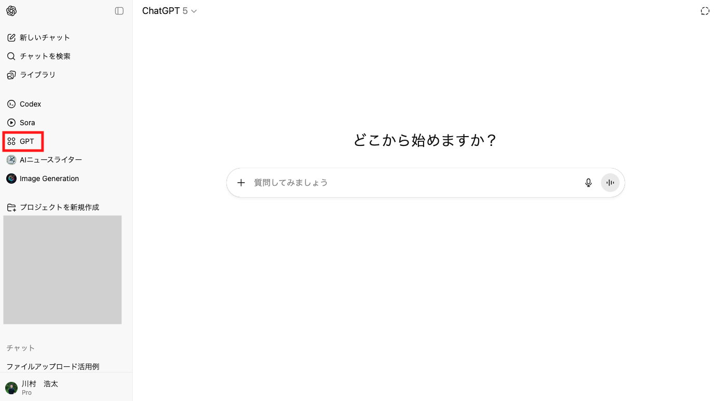

右上の「作成する」から作成画面へ進みます。
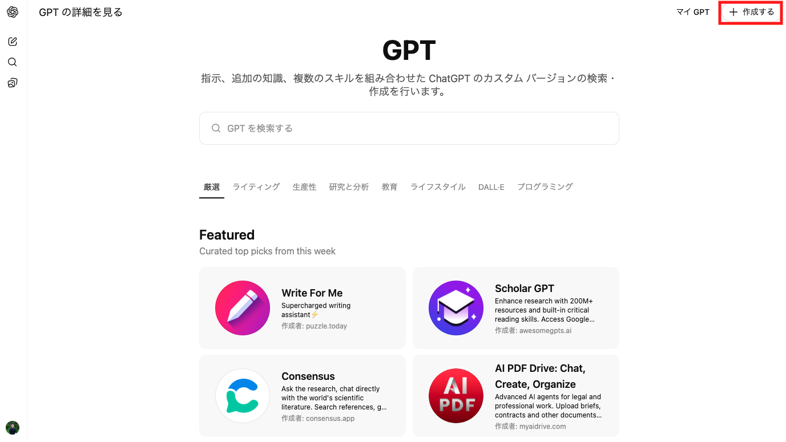

左側のチャット欄で質問に答える形で自動的に設定が出来上がります。

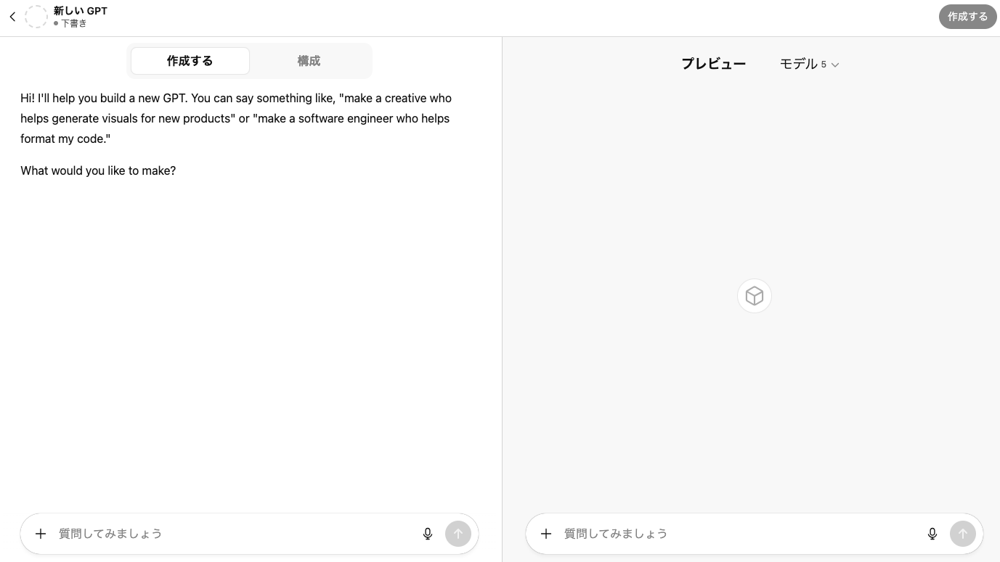

**対話イメージ**:
```
ChatGPT:「こんにちは！新しいGPTを作成するお手伝いをします。たとえば『新商品のビジュアルを生成するクリエイター』や『コードを整形するソフトウェアエンジニア』のように言ってください。何を作成したいですか？」

ユーザー:「企業ロゴを生成するGPTを作りたい。」

ChatGPT:「まずは初期設定を行いました。次に、このGPTの名前を決めましょう。」

ChatGPT:「では次に、このGPTのプロフィール画像を作りますね。」

ユーザー:「OK」

ChatGPT:「{画像}」

ユーザー:「OK」

ChatGPT:「では次に、このGPTがどんな内容を特に強調すべきか、または避けるべきかを決めましょう。」

ユーザー:「シンプル重視、グラデーションは使わない。」

ChatGPT:「これでロゴ設計スタジオの基本仕様は整いました。」
```

**2. 手動詳細設定（上級者向け）**

左側エリアの項目を入れていく方法もあります（詳細は後述）。

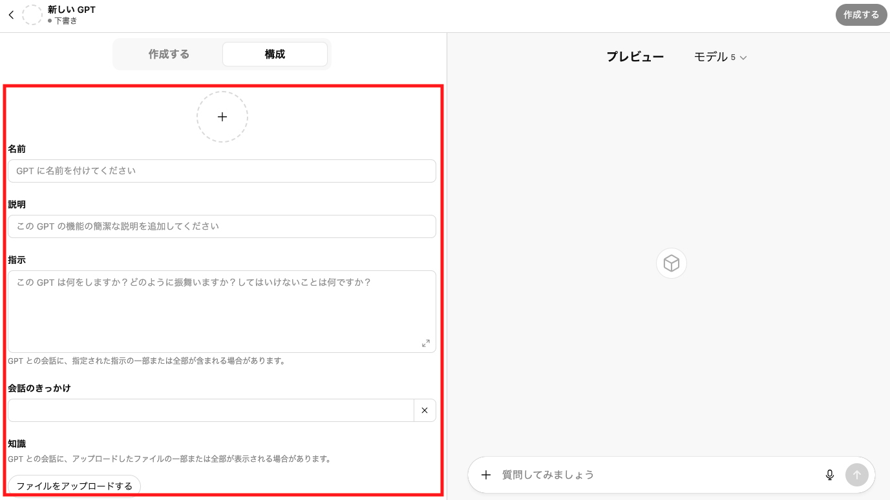


⚙️ **カスタムGPTの手動設定項目**

| 項目名 | 内容・概要 |
|--------|-----------|  
| **名前・タイトル** | AIのタイトル（例：経理特化ボット、営業資料作成AI） |
| **説明文** | 何をするGPTなのかの説明（共有時の紹介文） |
| **指示文（Instructions）** | GPTの振る舞い方（口調・専門性・禁止事項・出力形式など、最大8,000文字） |
| **会話スターター** | 初期質問例・ショートカットとしての定型文 |
| **知識ファイル** | AIが参照する追加情報（PDF・CSV・Word等のドキュメント） |
| **機能設定** | Web検索・画像生成・コード実行等のON/OFF切り替え |
| **外部アクション** | API/外部サービス連携や自動業務実行 |
| **公開範囲設定** | 自分専用・チーム限定・全体公開の選択 |

#### ハンズオン演習

> 
> 💡 **演習の進め方**
>
> 1. 各演習の状況設定を理解する
> 2. 記載されているプロンプト例をそのまま試す
> 3. 出力結果を確認し、より良い結果を得るためにプロンプトを修正します
> 4. 演習1〜3まで完了後、ユースケース例を参考に自業務での活用を検討してください
> 

**【演習1】企業ロゴ作成GPT**

| テーマ | 状況設定 |
|------|------|
| 企業ロゴ作成 - 対話式ロゴデザイン支援 | 新しく起業する企業のロゴを効率的に作成したい |

**GPTの設定内容**:

【初回のプロンプト】
```
企業のロゴを生成するGPTを作りたいです。
```
特にこだわりがなければOKなどでGPT側の提案に従ってOKです。

対話を通じて以下の情報を段階的に確認してください：
1. 企業の業種・事業内容
2. ターゲット顧客
3. 企業の理念・価値観
4. 希望するロゴの雰囲気（モダン、クラシック、カジュアルなど）
5. カラーの希望（あれば）

**チャット時の操作**:

【初回のプロンプト例】
```
新しく設立するIT企業のロゴを作りたいです。
```

または、より具体的な企業イメージを入力してみてください。

特にこだわりがなければ、OK、仮、という返答で進めてOK。

**【演習2】専門用語解説チャットボット**

| テーマ | 状況設定 |
|------|------|
| 専門用語解説 - 教育支援チャットボット | 複雑な専門用語を中学生にもわかるように段階的に説明してほしい |

**GPTの設定内容**:

【初回のプロンプト】
```
専門用語について中学生相手のようにステップバイステップで意味を教えるチャットボットです。

以下の手順で進めてください：

1. **用語の確認**
まず、教えたい専門用語が何かを確認します。

2. **基本的な説明**
その用語を中学生でも理解できる簡単な言葉で説明します。

3. **身近な例え**
日常生活の身近な例を使って説明します。

4. **理解度の確認**
「ここまでで分からないことはありますか？」と確認しながら進めます。

5. **詳細説明**
理解できているようなら、もう少し詳しい内容を説明します。

6. **まとめ**
最後に要点をまとめて、理解が深まったか確認します。

口調は親しみやすく、「ですます調」で、適度に質問を投げかけながら進めてください。

```

特にこだわりがなければOKなどでGPT側の提案に従ってOKです。

**チャット時の操作**:

【初回のプロンプト例】
```
「DX」という言葉の意味を教えてください。
```

または、何か知りたいテーマ（「AI」「ブロックチェーン」「クラウド」など）を適当に入力してみてください。

特にこだわりがなければ、OK、仮、という返答で進めてOK。

**【演習3】契約書作成支援GPT**

| テーマ | 状況設定 |
|------|------|
| 契約書作成 - ステップバイステップ契約書作成支援 | 契約書雛形をもとに、ステップバイステップで完成した契約書を作成したい |

**GPTの設定内容**:

【やりたいこと】
契約書雛形をもとに、ステップバイステップでGPTが回答して出来上がった契約書をダウンロードできるようにする

【静的ファイル（プロジェクトに保管）】
- [contract_template.docx](../../sample/contract_template.docx)（契約書雛形ファイル）

【初回のプロンプト】
```
アップロードされた契約書雛形の変数を理解した上で、ステップバイステップでユーザーに確認を行い、確認が終わったところで完成した契約書をダウンロードできるようにするGPTです。
```

特にこだわりがなければOKなどでGPT側の提案に従ってOKです。

**チャット時の操作**:

【初回のプロンプト例】
```
スタート
```
特にこだわりがなければ、OK、仮、という返答で進めてOK。

**ユースケース例**：自業務への応用

学習した内容を次も参考に自業務に生かしてください。

```
**人事部門の例**：
- 社内質問対応ボットの作成と運用
- 新人研修サポート用のAIアシスタント
- 労務相談の初期対応用チャットボット

**営業部門の例**：
- 提案書レビューと改善提案AI
- 顧客対応シナリオの練習相手
- 競合分析と差別化ポイント提案AI

**マーケティング部門の例**：
- コンテンツ企画と制作支援AI
- SNS投稿のトーン統一と品質チェック
- キャンペーン効果測定と改善提案AI
```

### 7-3 Scheduled Tasks

| 項目 | 内容 |
|------|------|
| **学習目標** | ChatGPTのスケジュール機能を活用した定期自動化技術の習得 |
| **対象機能** | Scheduled Tasks（タスク機能） |

#### 📚 この章で学ぶこと

⏰ **Scheduled Tasks機能の革新性**

ChatGPTのScheduled Tasks機能は、定期的なリマインダーや自動実行タスクを設定できる強力な自動化ツールです。従来手動で行っていた定期作業を自動化し、業務効率を大幅に向上させます。

🔧 **機能の基本設定手順**

1. **タスクの作成（自然言語での設定）**

チャット欄に自然言語で直接指示を入力することで、簡単にタスクを設定できます。例えば「毎日朝8時に今日のスケジュールをリマインドして」のような指示を入力すると、ChatGPTが自動的にタスクを設定し、確認メッセージを表示します。日時・頻度・実行内容をすべて自然言語で指定可能です。

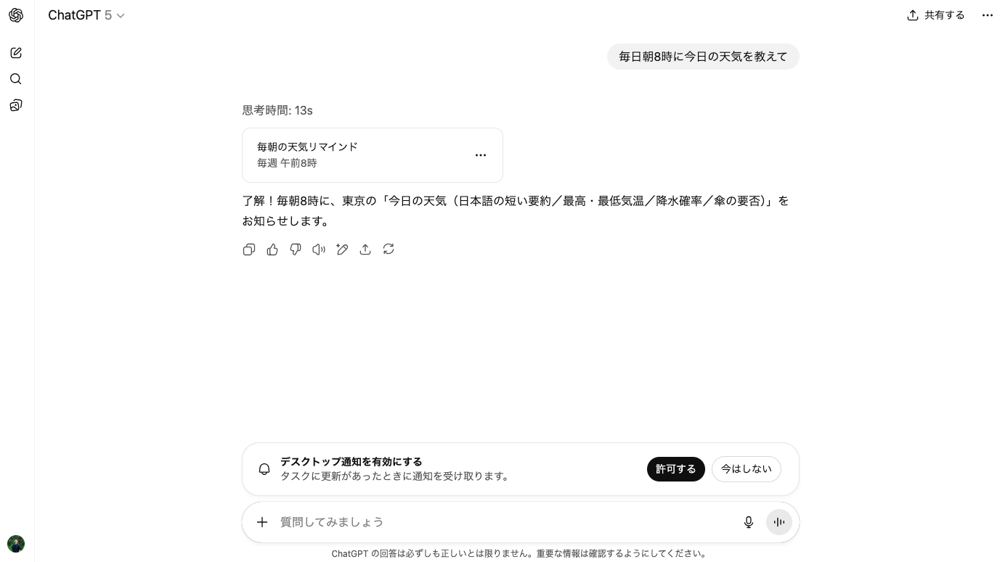

2. **タスクの管理・編集**

プロフィールアイコンから「Tasks」を選択すると、作成済みタスクの一覧を確認できます。各タスクの編集・一時停止・削除が可能で、通知設定の変更（Web・メール・モバイル）も行えます。

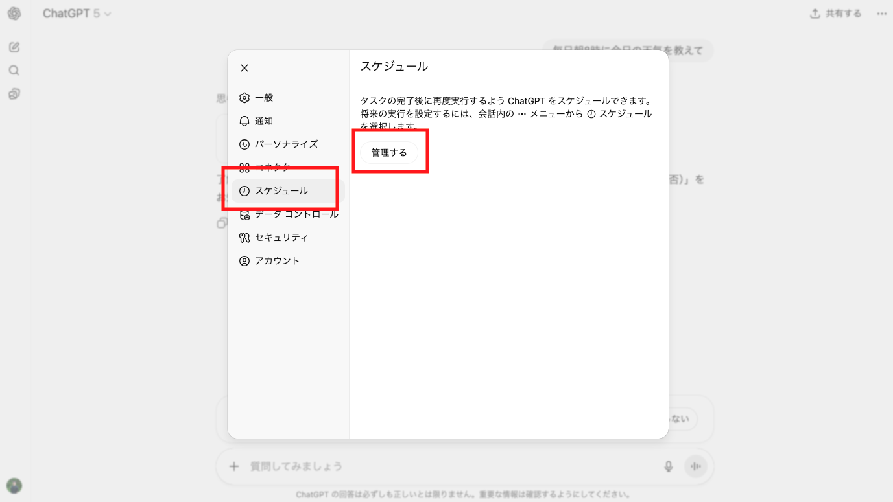

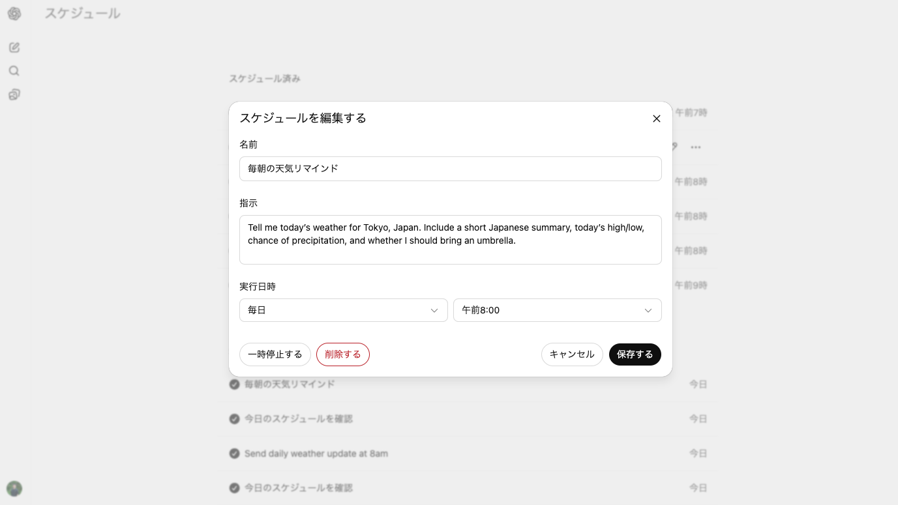

📊 **活用パターン**

1. **定期レポート生成**
   - 日次・週次・月次の業務レポート自動作成
   - KPI集計と分析レポート
   - 進捗状況の定期確認

2. **リマインダー設定**
   - 重要タスクの締切通知
   - 定期会議の事前準備リマインド
   - フォローアップ業務の忘れ防止

3. **情報収集の自動化**
   - 業界ニュースの定期収集
   - 競合情報のモニタリング
   - 市場動向の定点観測


#### ハンズオン演習

**【演習1】**

| テーマ | 状況設定 |
|------|------|
| 天気情報通知 - 毎日の業務計画サポート | 外回り営業が多いチームで、天候に応じた業務計画を立てたい |

**プロンプト例**:
```
毎日朝7時に、今日の天気予報を教えてください。

含める情報：
- 東京・大阪・名古屋の天気と気温
- 降水確率が50%以上の地域は強調表示
- 台風や大雨警報などの特別警報情報
- 営業活動への影響度（3段階評価）

最後に「傘が必要な地域」と「訪問を控えるべき地域」を
明確に示してください。
```

**【演習2】**

| テーマ | 状況設定 |
|------|------|
| AI業界情報通知 - 最新トレンドキャッチアップ | AI技術の進化が速い中、最新情報を定期的に把握したい |

**プロンプト例**:
```
毎週月曜日と木曜日の朝9時に、AI関連の重要ニュースをまとめて通知してください。

収集する情報：
1. ChatGPT・生成AIの新機能リリース
2. 主要IT企業のAI関連発表
3. AI規制・ガイドラインの動向
4. 実用的な活用事例（3つ）

各ニュースは以下の形式で：
【カテゴリ】ニュースタイトル
- 概要（50字以内）
- ビジネスへの影響度（高/中/低）
- 詳細確認が必要な項目にマーク
```

**【演習3】**

| テーマ | 状況設定 |
|------|------|
| 業界情報通知 - 競合動向モニタリング | 自社の競争力維持のため、業界動向を定期的にウォッチしたい |

**プロンプト例**:
```
毎週金曜日の17時に、今週の業界動向レポートを作成して通知してください。

対象業界：製造業（自動車部品）
監視項目：
1. 競合他社の新製品・新技術発表
2. 業界再編（M&A、提携）情報
3. 原材料価格の変動
4. 主要顧客（自動車メーカー）の動向

出力形式：
■ 今週のハイライト（3項目）
■ 詳細分析が必要な案件
■ 来週注目すべきイベント
■ 対応推奨アクション（優先度付き）
```

**ユースケース例**：自業務への応用

学習した内容を次も参考に自業務に生かしてください。

```
**営業部門の例**：
- 毎日の天気情報と業務計画の最適化
- 顧客フォローアップの定期リマインダー
- 競合他社の動向モニタリングと情報収集

**企画部門の例**：
- 業界トレンドの定期ウォッチと分析
- プロジェクトマイルストーンの進捗リマインダー
- 市場情報と新技術動向の自動収集

**マーケティング部門の例**：
- キャンペーン効果の定期測定とレポート作成
- ソーシャルメディアトレンドのモニタリング
- コンテンツ公開スケジュールのリマインダー
```

## 第8章: その他（参考）

### 8-1 Agent モード基礎

| 項目 | 内容 |
|------|------|
| **学習目標** | Agent機能による複雑なタスクの自動実行技術習得 |
| **対象機能** | Agent モード |

#### 📚 この章で学ぶこと

🤖 **Agent機能の革新性**

ChatGPTのAgent機能は、複数のステップを要する複雑なタスクを自動的に分解・実行する高度な自動化機能です。人間の指示を理解し、必要な手順を自律的に計画・実行します。この機能は新機能であり、動作が不安定な場合があります。

ツールセレクターからエージェントモードを選択した上でプロンプトを入力すると、ChatGPTが自動的に作業を進めてくれます。カード決済などの認証が必要な際は事前に許可を取ります。処理には10分以上要することが多いため、時間に余裕を持って実行することをお勧めします。

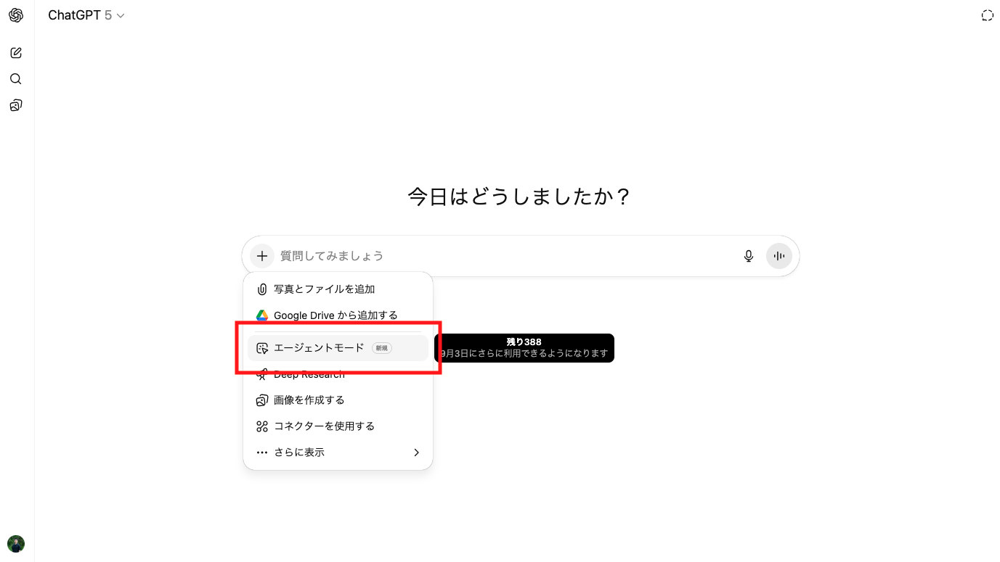

🎯 **Agent機能の特徴**

1. **タスクの自動分解**
   - 複雑な要求を実行可能なステップに分解
   - 各ステップの依存関係を理解
   - 最適な実行順序の決定

2. **インテリジェントな実行**
   - 各ステップの成功・失敗を判断
   - エラー時の自動リトライ
   - 代替手段の検討と実行

3. **結果の統合と報告**
   - 各ステップの実行結果を統合
   - 要求された形式での出力生成
   - 実行プロセスの透明性確保


#### ハンズオン演習

> 
> 💡 **演習の進め方**
>
> 1. 各演習の状況設定を理解する
> 2. 記載されているプロンプト例をそのまま試す
> 3. 出力結果を確認し、より良い結果を得るためにプロンプトを修正します
> 4. 演習1〜3まで完了後、ユースケース例を参考に自業務での活用を検討してください
> 

**【演習1】**

| テーマ | 状況設定 |
|------|------|
| ホテル予約の自動化 - 出張手配の効率化 | 複数の出張者のホテル予約を効率的に行いたい |

**プロンプト例**:
```
以下の出張者のホテル予約タスクを実行してください：

出張情報：
- 期間：2025年9月15日〜17日（2泊3日）
- 場所：東京駅周辺（徒歩10分以内）
- 人数：3名（シングルルーム×3）

要件：
1. 予算：1泊1万円〜1.5万円/人
2. 必須条件：Wi-Fi完備、朝食付き、24時間チェックイン可能
3. 希望条件：大浴場あり、コインランドリーあり

実行するタスク：
1. 条件に合うホテルを5つリストアップ
2. 各ホテルの特徴と料金を比較表にまとめる
3. アクセス情報（東京駅からの経路）を調査
4. 空室状況の確認方法を提示
5. おすすめ順位をつけて、理由を説明

最終的に、予約に必要な情報と手順を
分かりやすくまとめてください。
```

**【演習2】**

| テーマ | 状況設定 |
|------|------|
| プレゼン資料の自動作成 - 月次報告 | 毎月の部門業績報告プレゼンを効率的に作成したい |

**プロンプト例**:
```
営業部門の月次報告プレゼン資料を作成してください：

必要な内容：
1. 先月の売上実績と予算対比（達成率含む）
2. 商品カテゴリ別の売上分析
3. 新規顧客獲得数と既存顧客のリピート率
4. 今月の重点施策と進捗状況
5. 来月の目標と達成のための具体的アクション

スライド構成：
- 表紙（1枚）
- エグゼクティブサマリー（1枚）
- 詳細分析（3-4枚）
- 今後の方針（1-2枚）

参考情報
1. 売上実績と予算対比
項目 予算 実績 達成率
合計 5,000万円 4,750万円 95%
先月比：+3%
主因：主力商品の値引きキャンペーン効果

2. 商品カテゴリ別売上
カテゴリ 売上 前月比 構成比
家電 2,000万円 +5% 42%
生活雑貨 1,500万円 +2% 32%
食品 1,250万円 -1% 26%
家電は新製品発売により大幅増
食品は天候不順で需要減

3. 顧客動向
新規顧客獲得数：120社（目標100社、達成率120%）
既存顧客リピート率：68%（前月比+4pt）

4. 今月の重点施策と進捗
施策 目標 進捗 コメント
新規顧客開拓キャンペーン 100社 120社 達成
ECサイトUI改善 CVR+10% +7% 継続中
既存顧客向けロイヤルティプログラム リピ率70% 68% 惜しくも未達

5. 来月の目標とアクション
売上目標：5,200万円（前月比+9%）
アクションプラン：
季節商戦に合わせた食品プロモーション強化
法人向け家電まとめ買いプラン開始
ECサイト改善第2フェーズ（決済UIの高速化）

各スライドには適切なグラフや図表を含め、
重要なポイントは強調表示してください。
```

**【演習3】**

| テーマ | 状況設定 |
|------|------|
| ニュース収集の自動化 - 最新ビジネス情報の収集 | 日経新聞の最新記事から業界動向を把握し、経営判断に活用したい |

※アカウントをお持ちのポータルサイトに置き換えてください。
※作業途中にログイン手続きが必要な場合があります。

**プロンプト例**:
```
日経新聞から最新のビジネス記事を取得し、整理してください：

取得条件：
- 対象期間：過去24時間以内の記事
- カテゴリ：「企業」「マーケット」「テクノロジー」
- キーワード：「AI」「DX」「半導体」を含む記事を優先

実行するタスク：
1. 記事の自動取得
   - 見出しと本文を取得
   - 関連する図表やグラフも収集

2. 記事一覧の表形式整理
   以下の項目で表を作成してください：
   | ニュースタイトル | 要約（50字以内） | URL |
```

**ユースケース例**：自業務への応用

学習した内容を次も参考に自業務に生かしてください。

```
**総務部門の例**：
- 出張手配や会場予約の自動化
- 各種申請手続きのガイド作成
- 定期業務のチェックリスト自動生成

**企画部門の例**：
- 市場調査レポートの自動作成
- 競合分析資料の体系的な整理
- 新事業企画書のフレームワーク作成

**経営企画部門の例**：
- 業界動向分析と戦略的意意併せの識別
- 市場トレンドからの事業機会発掘
- KPIダッシュボードの自動生成と分析
```

### 8-2 Record Mode活用

| 項目 | 内容 |
|------|------|
| **学習目標** | 音声録音・文字起こし機能を活用した効率的な議事録作成技術習得 |
| **対象機能** | Record Mode |

#### 📚 この章で学ぶこと

🎙️ **Record Mode機能の概要**

ChatGPTのRecord Mode機能は、音声をリアルタイムで文字起こしし、自動的に議事録を生成する新しい機能です。チャット入力欄の右側に表示される「レコードマーク」を押すことで録音が開始され、録音終了後に議事録がCanvas機能内に自動作成されます。

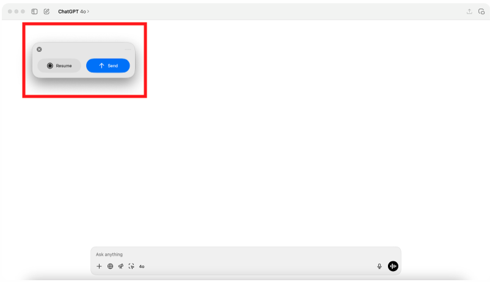

🎯 **Record Mode機能の特徴と制限**

1. **議事録生成プロセス**
   - マイクからの音声録音。PC内音声も録音可能
   - 録音終了後「送信」ボタンで自動議事録作成
   - Canvas機能内に構造化された議事録を生成
   - タイムスタンプ付きで文字起こし内容を確認可能
   - PDFダウンロード・リンク共有に対応

2. **言語・カスタマイズ対応**
   - デフォルト要約言語：英語（設定言語が日本語でも英語生成）
   - Canvas内チャットで日本語翻訳・形式変更が可能
   - カスタムインストラクションは反映されない
   - プロジェクト機能でも設定が適用されない場合がある

3. **現在の制限事項**
   - **話者識別不可**: 複数人の会議で発言者の区別ができない
   - **外部連携なし**: Googleドキュメント・Notionへの直接インポート不可
   - **カスタマイズ制限**: ユーザー設定の反映が限定的

📱 **Record Mode活用の実践手順**

1. **録音開始**
   - デスクトップアプリでチャット画面を開く
   - 右側のレコードマークをクリック
   - 録音許可を承認

2. **録音中の工夫**
   - 会議の目的・参加者を最初に述べる
   - 発言者名を都度明示（話者識別補完のため）
   - 重要な決定事項は「決定」と明言
   - 数字や固有名詞は明確に発音

3. **録音後の処理**
   - 「送信」ボタンで議事録生成を実行
   - Canvas内で英語議事録を確認
   - 「日本語に翻訳して」でローカライズ
   - 必要に応じて形式変更やタスクリスト化を依頼


#### ハンズオン演習

> 
> 💡 **演習の進め方**
>
> 1. 各演習の状況設定を理解する
> 2. 記載されているプロンプト例をそのまま試す
> 3. 出力結果を確認し、より良い結果を得るためにプロンプトを修正します
> 4. 演習1〜3まで完了後、ユースケース例を参考に自業務での活用を検討してください
> 

**【演習1】**

| テーマ | 状況設定 |
|------|------|
| アイデア出し会議の要約 - ブレインストーミングの可視化 | 新サービス企画のブレインストーミングを行い、アイデアを整理したい |

**プロンプト例**:
```
新サービス企画のブレインストーミング録音から、アイデアを整理してください：

整理する内容：
1. アイデアの分類
   - サービスカテゴリ別（BtoB/BtoC、オンライン/オフライン等）
   - 実現可能性別（短期/中期/長期）
   - 投資規模別（小/中/大）

2. 各アイデアの詳細
   - アイデア名と概要（50字以内）
   - ターゲット顧客
   - 期待される効果
   - 必要なリソース

3. 評価と優先順位
   - 参加者の支持が高かったアイデアTOP5
   - 実現可能性が高いアイデアTOP3
   - 革新性が高いアイデアTOP3

4. ネクストアクション
   - 詳細検討が必要なアイデア
   - 追加調査が必要な項目
   - 次回会議までのタスク

マインドマップ形式での視覚化案も
提示してください。
```

**【演習2】**

| テーマ | 状況設定 |
|------|------|
| 社内MTGの議事録作成 - 定例会議の効率化 | 部門横断の定例会議を実施し、決定事項とタスクを明確化したい |

**プロンプト例**:
```
部門横断定例会議の録音を文字起こしし、議事録を作成してください：

議事録の構成：
1. 会議情報
   - 日時：2024年2月15日 14:00-15:30
   - 参加者：営業部、開発部、マーケティング部の各責任者
   - 議題：新製品ローンチプロジェクトの進捗確認

2. 各部門の報告（部門別に整理）
   - 進捗状況（計画対比％表示）
   - 直面している課題
   - 他部門への依頼事項

3. 議論内容
   - 主要な論点と各部門の意見
   - 合意に至った点
   - 継続検討事項

4. 決定事項
   - 承認された施策（実施時期明記）
   - 予算配分の変更
   - スケジュール調整

5. アクションアイテム一覧
   - タスク内容｜担当部門｜担当者｜期限｜優先度
   （表形式で整理）

最後に、各部門へのリマインドメールの
文案も作成してください。
```

**【演習3】**

| テーマ | 状況設定 |
|------|------|
| 商談内容のまとめ - 営業活動の記録と分析 | 重要顧客との商談を実施し、内容を社内共有用にまとめたい |

**プロンプト例**:
```
顧客との商談録音から、商談レポートを作成してください：

商談情報：
- 顧客：△△製造株式会社
- 参加者：先方）購買部長、情報システム部課長／当社）営業部長、SE
- 目的：新システム導入の提案

レポートに含める内容：
1. 顧客の現状と課題
   - 現行システムの問題点
   - 業務上の困りごと（優先度付き）
   - 予算感と決裁プロセス

2. 提案内容への反応
   - 好感触だったポイント
   - 懸念事項・質問事項
   - 競合他社の動向

3. 商談の温度感分析
   - 購買意欲レベル（5段階評価）
   - キーパーソンの反応
   - 成約確度の判定（％）

4. ネクストステップ
   - 宿題事項と回答期限
   - 次回アポイントの内容
   - 社内で準備すべきこと

5. 営業戦略の提案
   - 攻めるべきポイント
   - リスク要因と対策
   - クロージングまでのシナリオ

Salesforceへの入力用サマリーも
併せて作成してください。
```

**ユースケース例**：自業務への応用

学習した内容を次も参考に自業務に生かしてください。

```
**営業部門の例**：
- 顧客との商談内容の効率的な記録と分析
- 提案プレゼン後のフィードバック整理
- チーム会議での成功事例共有の構造化

**企画部門の例**：
- ブレインストーミング内容の体系的な整理
- ステークホルダー会議の決定事項明確化
- プロジェクト進捗会議の議事録とタスク管理

**人事部門の例**：
- 面接内容の記録と評価ポイント整理
- 社内研修のフィードバック収集と分析
- 管理職会議でのマネジメント課題の可視化
```
