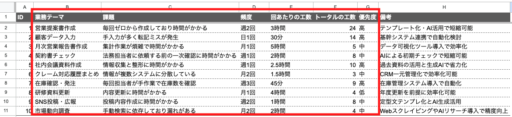
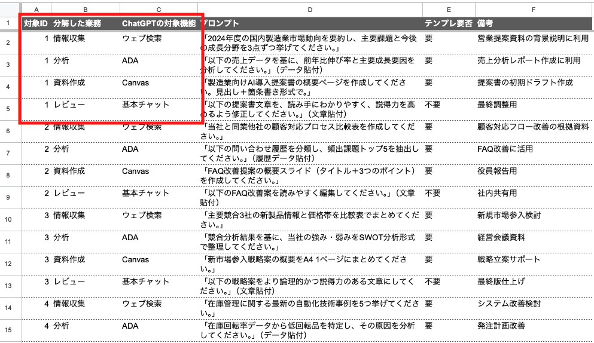
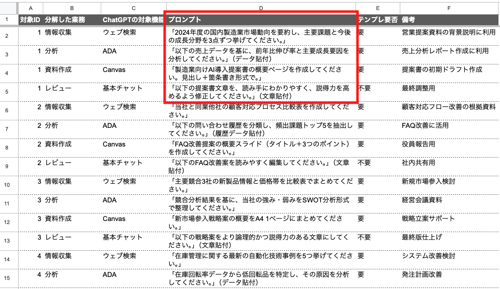
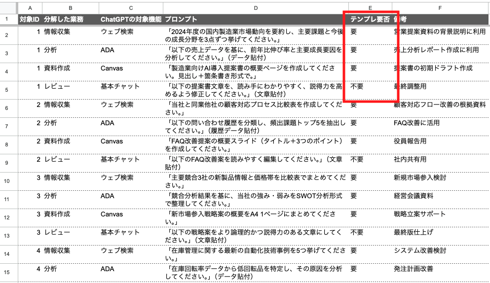
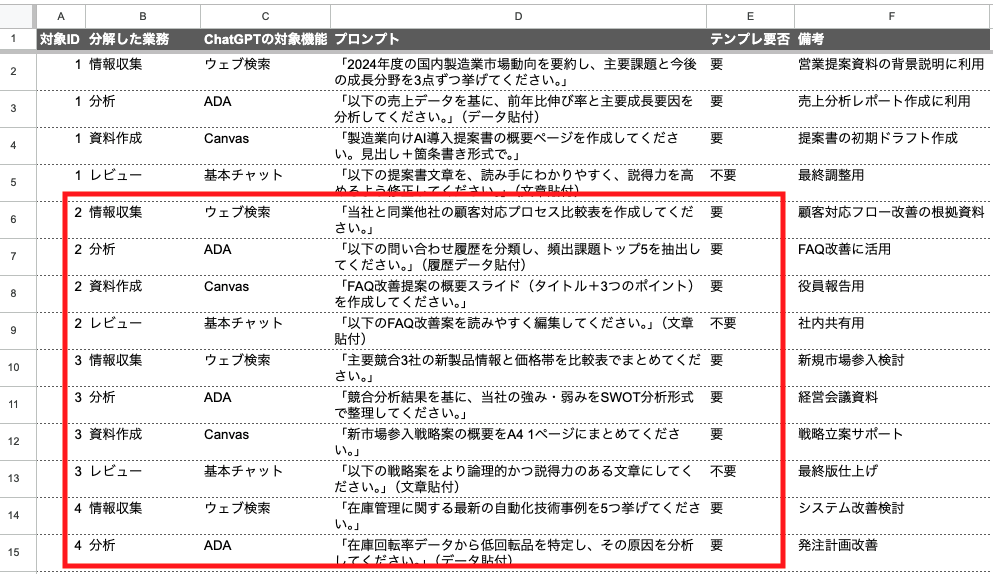

# 📙 Level 3: 課題分析と自律的問題解決手法テキスト
**対象**: Level 3受講者

## 第9章: 課題ドリブンChatGPT活用手法

### 9-1 課題ドリブン活用方法論

| 項目 | 内容 |
|------|------|
| **学習目標** | 業務課題からChatGPT活用まで一貫した4ステップ方法論の概観理解 |
| **対象機能** | フレームワーク理解 |

#### 📚 この章で学ぶこと

**Level 1-2との違い**:
- Level 1-2: **機能ドリブン** - ChatGPTの機能を学んで業務に適用
- Level 3: **課題ドリブン** - 業務課題から逆算してChatGPTを活用

**4ステップ方法論の概観**:

| ステップ | タイトル | 目的 | 成果物 | 重要ポイント |
|---------|----------|------|--------|------------|
| **ステップ1** | 課題抽出・発見 | 日常業務の中から改善すべき課題を体系的に発見・整理 | 課題発見シート（Excel） | 課題の定量化と優先順位付け |
| **ステップ2** | 業務分解とChatGPT機能特定 | 課題となっている業務を細分化し、各プロセスに最適なChatGPT機能を選定 | 業務分解・機能マッピングシート（Excel） | 人間とAIの役割分担の明確化 |
| **ステップ3** | プロンプト作成 | 選定した機能で実際に使えるプロンプトを作成し、試行錯誤を通じて最適化 | プロンプト集（Excel） | 効果測定に基づく継続的改善 |
| **ステップ4** | テンプレート化 | 最適化されたソリューションを標準化し、継続活用・横展開可能にする | 運用テンプレート・マニュアル | 持続可能な仕組み作り |

**自律的課題解決のマインドセット**:

- 課題を「ChatGPTで解決できるか」ではなく「どう解決するか」で考える
- 完璧を求めず、小さく始めて段階的に改善する
- 個人の成果を組織の資産として蓄積する

### 9-2 課題抽出・発見

| 項目 | 内容 |
|------|------|
| **学習目標** | 日常業務から改善すべき課題を発見し、課題発見シート（Excel）で体系化する技術習得 |
| **対象機能** | 基本チャット（課題整理） |

#### 📚 この章で学ぶこと
- 課題発見のためのセルフチェック手法
- 業務時間分析による非効率ポイント特定
- 課題の緊急度・重要度マトリックス
- ChatGPT適用可能性の簡易判定法

**エクセルワーク：課題発見シート作成**

以下の項目で課題を整理します：

| 項目 | 説明 |
|------|------|
| ID | 課題の通し番号（例：C001, C002...） |
| 業務テーマ | 課題が発生している業務領域（例：営業活動、資料作成、顧客対応） |
| 課題 | 具体的な課題内容（例：提案書作成に時間がかかりすぎる） |
| 頻度 | 課題が発生する頻度（例：週3回、月1回） |
| 回あたりの工数 | 1回あたりにかかる時間（例：3時間、30分） |
| トータルの工数 | 月間での総工数（頻度×回あたりの工数×4週） |
| 優先度 | 改善の優先度（高・中・低） |

#### ハンズオン演習

> 
> 💡 **演習の進め方**
>
> 1. 日常業務を振り返り、改善したい課題を10個程度リストアップ
> 2. 各課題について頻度と工数を実際の状況に基づいて記入
> 3. 優先度は「高・中・低」で設定（高：月20時間以上、中：月10-20時間、低：月10時間未満を目安）
> 4. 上位3つの課題を選定し、これらを9-3以降で詳細分析する対象とする
> 



💡 **ChatGPTの活用**: 課題整理が困難な場合は、上記のプロンプト例を使用してChatGPTに相談することも可能です。

**課題抽出支援プロンプト例**:

```
私の日常業務を分析して、ChatGPTで改善できそうな課題を抽出したいと思います。

以下の観点で課題を分析してください：
1. 時間がかかりすぎている作業
2. 繰り返し発生する定型的な作業
3. ミスが発生しやすい作業
4. 創造性や判断が求められるが時間不足で十分できていない作業

各課題について「課題内容」「発生頻度」「1回あたりの工数」「なぜその課題が発生するか」を整理してください。

【私の業務内容】
- 職種：[あなたの職種]
- 主な業務：[主要な業務を3-5個]
- 1日の流れ：[簡単な1日の業務フロー]
```

### 9-3 業務分解とChatGPT機能特定

| 項目 | 内容 |
|------|------|
| **学習目標** | 課題となっている業務を構成要素に分解し、最適なChatGPT機能を選定してExcelシートに整理する技術習得 |
| **対象機能** | 基本チャット（業務分析）+ Level 1-2で習得した全機能 |

#### 📚 この章で学ぶこと

📌 **1. 業務プロセスの分解手法**

複雑な業務を系統的に分解し、AIと人間の役割分担を明確にする手法を学びます。

- 業務プロセスの可視化手法
- インプット・処理・アウトプット分析
- 人間が行うべき部分とAIに任せられる部分の切り分け
- 分解粒度の最適化

📊 **2. ChatGPT機能の選定方法**

業務タイプと制約条件を考慮し、最適なChatGPT機能を選定する方法論を学びます。

- 業務タイプ別最適機能マッピング
- 単機能 vs 複数機能組み合わせの判断基準
- 機能選定時の制約条件（時間・コスト・精度）

🎯 **3. 業務分解・機能マッピングシート作成**

分解した業務と選定したChatGPT機能を体系的に整理するExcelシートを作成します。

9-2で選定した課題IDについて、新しいシートを作成し以下の項目で整理します：

| 項目 | 説明 |
|------|------|
| 対象ID | 9-2で選定した課題のID（例：C001） |
| 分解した業務 | 業務を細分化したステップ（例：情報収集、分析、資料作成） |
| ChatGPTの対象機能 | 各業務に最適な機能（例：ウェブ検索、ADA、Canvas） |
| プロンプト | （このステップでは空欄のまま） |
| テンプレ要否 | （このステップでは空欄のまま） |

#### ハンズオン演習

> 
> 💡 **演習の進め方**
>
> 1. 9-2で選定した上位3つの課題について、それぞれ業務プロセスを3-5個のステップに分解
> 2. 各ステップを1行ずつ記入（例：「情報収集」「データ分析」「資料作成」「レビュー・修正」）
> 3. 各業務ステップに最適のChatGPT機能を選定して記入
> 



**利用可能なChatGPT機能**：

- 基本チャット：テキスト生成、要約、分析
- ファイルアップロード：PDF/Word/Excel等の読み込み・分析  
- ADA：データ分析、グラフ作成
- Vision：画像生成・編集
- ウェブ検索：最新情報の収集
- Canvas：文書・コード編集
- カスタムGPT：専用ツール作成

**業務分解支援プロンプト例**:

```
この課題解決のための業務プロセスを3-5個のステップに分解し、各ステップに最適なChatGPT機能を提案してください。
利用可能機能：基本チャット、ファイルアップロード、ADA、Vision、ウェブ検索、Canvas、カスタムGPT

【課題】[9-2で選定した課題]
```

### 9-4 プロンプト作成（試用・チューニング）

| 項目 | 内容 |
|------|------|
| **学習目標** | 選定した機能での実際のプロンプト作成、初期検証、効果測定に基づく最適化を行い、Excelシートに記録する技術習得 |
| **対象機能** | 選定された機能の組み合わせ + 効果測定 |

#### 📚 この章で学ぶこと

📌 **1. プロトタイププロンプト設計**

実用性を重視した初期プロンプトの設計手法と、小規模テストでの検証方法を学びます。

- プロトタイプ的プロンプト設計手法
- 小規模テストの実施方法
- 期待値設定と結果評価の観点

📈 **2. 効果測定と最適化**

時間短縮、品質向上、精度改善の観点で効果を測定し、A/Bテスト的アプローチで改善する手法を学びます。

- 効果測定指標の設定（時間短縮・品質向上・精度改善）
- A/Bテスト的アプローチでの改善
- プロンプトの段階的改良手法
- チューニング終了の判断基準

📋 **3. プロンプト作成の流れ**

初期作成から最終確定までの5段階プロセスを理解し、系統的なプロンプト開発手法を学びます。

1. **初期プロンプト作成**: 9-3で特定した機能に対する基本プロンプトを作成
2. **テスト実行**: 実際のデータでプロンプトをテスト
3. **効果測定**: 時間短縮・品質・精度の観点で効果を測定
4. **改善・チューニング**: 測定結果を基にプロンプトを改良
5. **最終プロンプト確定**: チューニング完了後のプロンプトをExcelに記録

#### ハンズオン演習

> 
> 💡 **演習の進め方**
>
> 1. 9-3で作成した「業務分解・機能マッピング」シートを開く
> 2. 各業務ステップに対して、以下の要素を含む初期プロンプトを作成：
> 3. 作成したプロンプトを実際のデータでテスト実行
> 4. 改善点を特定し、プロンプトを最適化
> 5. 改善・最適化されたプロンプトをExcel「プロンプト」列に記録
> 



**プロンプト作成支援ツール**:

複雑なプロンプト作成が困難な場合は、ChatGPTにプロンプト作成を支援してもらうことも可能です。

**プロンプト作成支援プロンプト例**:

```
上記の業務に最適なプロンプトを作成してください。シンプルで実用的なものでお願いします。

【業務】[業務ステップ名]
【使用機能】[選定したChatGPT機能]
【目的】[この業務で達成したい結果]
```

### 9-5 テンプレート化

| 項目 | 内容 |
|------|------|
| **学習目標** | 最適化されたソリューションの標準化と横展開を行い、テンプレート要否をExcelに記録する技術習得 |
| **対象機能** | カスタムGPT + プロジェクト |

#### 📚 この章で学ぶこと

📌 **1. テンプレート設計原則**

再利用可能で横展開できるテンプレートの設計原則と標準化手法を学びます。

- 再利用可能なテンプレート設計原則
- カスタムGPT化による標準化
- 他業務・他メンバーへの横展開手法

📊 **2. テンプレート要否の判断基準**

使用頻度、共有可能性、応用範囲を基準に、テンプレート化の必要性を判断する手法を学びます。

- **要**: 定期的に使用する、他の人も使う可能性がある、類似業務に応用できる
- **不要**: 一回限りの使用、個人専用、カスタマイズが頻繁に必要

💯 **3. テンプレート化の選択肢**

カスタムGPT、プロジェクト、プロンプトライブラリの3つの選択肢と、それぞれの適用基準を学びます。

1. **カスタムGPT作成**: 専用ツールとして独立させる
2. **プロジェクト活用**: 個人での継続使用とファイル・設定の一元管理
3. **プロンプトライブラリ**: 個人用のプロンプト集として保存（具体的な手段としてはメモアプリに残していくなど）

#### ハンズオン演習

> 
> 💡 **演習の進め方**
>
> 1. 9-4で記録したプロンプトを確認
> 2. 「業務分解・機能マッピング」シートの「テンプレ要否」列を使用
> 3. 「要」と判定したプロンプトについて、以下のいずれかでテンプレート化を実装：
> 



### 9-6 総合演習：追加課題での実践

| 項目 | 内容 |
|------|------|
| **学習目標** | 4ステップ方法論を使った追加課題での実践力定着 |
| **対象機能** | Level 1-3で習得した全機能 |

#### 演習の進め方

> 
> 💡 **演習の進め方**
>
> 1. 9-2で抽出した課題の中から優先度2位・3位の課題を選択（または新たに発見した課題から2つを選択）
> 2. 各追加課題について以下のステップを実行：
>    - **課題抽出・発見**: 課題発見シートに追加記録
>    - **業務分解・機能特定**: 新シート作成し業務分解と機能選定
>    - **プロンプト作成**: テスト・改善を経てプロンプト記録
>    - **テンプレート化**: テンプレート要否判定と実装
> 3. 3課題分の完成版Excelシートと実装済みテンプレート群を作成
> 



---

## 🎉 Level 3 修了おめでとうございます！

Level 3の課題ドリブン活用手法の学習、お疲れ様でした。

このレベルでは、単にChatGPTの機能を学ぶだけではなく、実際の業務課題から出発し、体系的なアプローチで問題解決を行う手法を身につけました。4ステップ方法論（課題抽出・発見、業務分解と機能特定、プロンプト作成、テンプレート化）を通じて、持続可能で効果的なAI活用ができるようになったことと思います。

作成したExcelシートやテンプレートは、今後の業務改善の貴重な資産となります。ぜひ継続的に活用し、さらなる効率化を図ってください。

ChatGPTを活用した自律的な課題解決の旅は、ここからが本当のスタートです。学習した手法を実践に活かし、より生産的で創造的な業務を実現していってください！