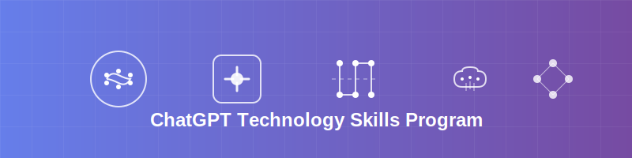
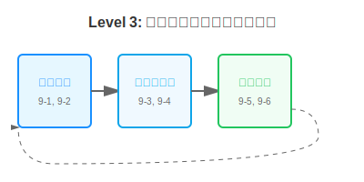
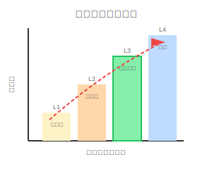

# ChatGPT能力向上プログラム - 詳細ガイド（地図）

## 📖 目次

1. [🎯 プログラムの目的](#🎯-プログラムの目的)
2. [🗺️ 進め方](#🗺️-進め方)
3. [📊 レベル定義](#📊-レベル定義)
4. [📋 レベル詳細](#📋-レベル詳細)
   - [Level 1: 基本機能ドリブン学習](#level-1-基本機能ドリブン学習)
   - [Level 2: 高度機能・統合活用](#level-2-高度機能・統合活用)
   - [Level 3: 課題分析と自律的問題解決手法](#level-3-課題分析と自律的問題解決手法)
   - [Level 4: 自律的改善サイクル](#level-4-自律的改善サイクル)
5. [📅 プログラム実施スケジュール](#📅-プログラム実施スケジュール)
6. [📚 マテリアル活用ガイド](#📚-マテリアル活用ガイド)
7. [📋 ワークシート詳細活用ガイド](#📋-ワークシート詳細活用ガイド)
8. [📞 サポート体制](#📞-サポート体制)

---

## 🎯 プログラムの目的

ChatGPTの基本機能から高度機能まで段階的に習得し、自業務での継続的な活用を実現する。
**①情報取得** → **②試用** → **③運用** の3段階を軸とし、段階的な自律性向上を図る。

---

## 🗺️ 進め方

### 学習フレームワーク
**①情報取得** → **②試用** → **③運用** の3段階を軸とし、段階的な自律性向上を図る

### 段階的自律性の向上
- **Level 1**: 手取り足取りの指導で基礎固め
- **Level 2**: 複数機能の組み合わせによる応用力養成
- **Level 3**: 自分で考えて実行する力を養成
- **Level 4**: 完全に自立して学習・改善を継続

---

## 📊 レベル定義

| レベル | 目的 | 自律性 | 起点 | 合格要件 | 成果物 |
|---|---|---|---|---|---|
| **Level 1 "基本機能"** | *ChatGPT基本機能とプロンプト* を習得し、各自の業務に基本的な活用方法を結び付ける | **ガイド** | **機能** | ・ChatGPTの基本機能（1-1～4-2）を試し、機能ごとに業務で使えるユースケースを考える | ➊ **演習①〜④の出力結果** ➋ **自業務のユースケース** |
| **Level 2 "高度機能"** | *高度機能と統合活用* を習得し、複雑な業務課題に対する解決策を設計・実践する | **ガイド** | **機能** | ・ChatGPTの高度機能（5-1～8-2）を試し、機能ごとに業務でのユースケースを考える ・Lv1で定義したユースケースを一定頻度で活用している（実施頻度の50%程度についてChatGPTを活用） | ➌ **演習①〜④の出力結果** ➍ **自業務のユースケース** ➎ **活用実績ログ** |
| **Level 3 "課題分析と自律的問題解決手法"** | 自業務の課題を抽出し、最適機能を**自分で選び→組み→運用に乗せる**（※反復サイクル） | **ガイド** | **課題** | ・課題軸で抽出したユースケースでのChatGPT活用方法を定義している ・Lv1,2で定義したユースケースを一定頻度で活用している（実施頻度の50%程度についてChatGPTを活用） | ➏ **エクセルワーク（9-2～9-5）** ➐ **自業務のユースケース** ➑ **活用実績ログ** |
| **Level 4 "継続改善"** | Level 3 の延長として、機能アップデート検証と新ユースケース創出を定期運用 | **自律** | **-** | 支援対象外（自律的な継続学習） | 支援対象外 |

---

## 📋 レベル詳細

### Level 1: 基本機能ドリブン学習

#### 🎯 目標
**基本機能理解**: プロンプトエンジニアリング、ファイルアップロード、ADA、画像生成の体系的学習
**単機能習得**: 各機能を個別に理解し簡単なユースケースを創出
**心理的安全性**: ガイド付きで失敗リスクを最小化

#### 📈 自律性レベル
**ガイド** - 手取り足取りの指導による基礎固め

#### 📚 学習内容と提供機能

##### 第1章: 基本チャット機能とプロンプトエンジニアリング
| 章 | 内容 | 推奨機能セット | 必須・選択 |
|---|---|---|---|
| 1-1 | 基本的な質問と回答 | 基本チャット | 必須 |
| 1-2 | プロンプトエンジニアリング | 基本チャット | 必須 |
| 1-3 | 出力形式の制御 | 基本チャット | 必須 |
| 1-4 | 用途別プロンプト作成 | 基本チャット | 必須 |

##### 第2章: ファイルアップロード機能活用
| 章 | 内容 | 推奨機能セット | 必須・選択 |
|---|---|---|---|
| 2-1 | Office文書処理 | ファイルアップロード（Word/Excel/PPT） | 必須 |
| 2-2 | 画像認識・理解 | Vision | 必須 |

##### 第3章: Advanced Data Analysis（ADA）機能
| 章 | 内容 | 推奨機能セット | 必須・選択 |
|---|---|---|---|
| 3-1 | Excelデータ分析 | ADA + Excel | 必須 |
| 3-2 | データ可視化 | ADA + Excel + グラフ作成 | 必須 |

##### 第4章: 画像生成
| 章 | 内容 | 推奨機能セット | 必須・選択 |
|---|---|---|---|
| 4-1 | ChatGPTを使ったビジネス画像作成 | 画像生成 | 必須 |
| 4-2 | ChatGPTを使ったビジネス画像作成の工夫 | 画像生成 | 必須 |

---

### Level 2: 高度機能・統合活用

#### 🎯 目標
**高度機能習得**: 検索・ツール、Canvas、プロジェクト・カスタムGPT、Agent・Recordモードの理解
**機能組み合わせ**: 複数機能を組み合わせた高度なワークフロー設計
**統合実践**: 機能連携による業務効率化の実現

#### 📈 自律性レベル
**ガイド** - 複数機能の組み合わせによる応用力養成

#### 📚 学習内容と提供機能

##### 第5章: 検索・ツール活用
| 章 | 内容 | 推奨機能セット | 必須・選択 |
|---|---|---|---|
| 5-1 | ウェブ検索・Deep Research活用 | ウェブ検索 + Deep Research | 必須 |
| 5-2 | コネクタ連携 | コネクタ | 選択 |

##### 第6章: キャンバス機能
| 章 | 内容 | 推奨機能セット | 必須・選択 |
|---|---|---|---|
| 6-1 | Canvas文書編集 | Canvas（文書編集） | 必須 |
| 6-2 | Canvasコード編集 | Canvas（コード編集） | 選択 |

##### 第7章: プロジェクト・カスタムGPT機能
| 章 | 内容 | 推奨機能セット | 必須・選択 |
|---|---|---|---|
| 7-1 | プロジェクト作成 | プロジェクト機能 | 必須 |
| 7-2 | GPT作成基礎 | カスタムGPT作成 | 必須 |
| 7-3 | Scheduled Tasks | Scheduled Tasks | 選択 |

##### 第8章: その他（参考）
| 章 | 内容 | 推奨機能セット | 必須・選択 |
|---|---|---|---|
| 8-1 | Agent モード基礎 | Agent モード | 必須 |
| 8-2 | Record Mode活用 | Record Mode | 必須 |

---

### Level 3: 課題分析と自律的問題解決手法

#### 🎯 目標
**課題分析**: 自業務の真の課題を特定・言語化（9-1～9-2）
**最適解設計**: 課題に対する機能組み合わせを自分で設計（9-3～9-4）
**運用定着**: 業務プロセスに組み込み、継続的に活用（9-5～9-6）

#### 📈 自律性レベル
**ガイド** - 自分で考えて実行する力を養成（課題起点）

#### 📚 学習内容と提供機能

##### 第9章: 課題ドリブンChatGPT活用手法
| 章 | 内容 | 推奨機能セット | 必須・選択 |
|---|---|---|---|
| 9-1 | 課題ドリブン活用方法論 | 課題分析フレームワーク + 全機能 | 必須 |
| 9-2 | 課題抽出・発見 | 課題分析手法 | 必須 |
| 9-3 | 業務分解とChatGPT機能特定 | 業務プロセス分析 + 機能マッピング | 必須 |
| 9-4 | プロンプト作成（試用・チューニング） | 選定機能での実装 | 必須 |
| 9-5 | テンプレート化 | 効果測定 + 標準化 | 必須 |
| 9-6 | 総合演習：3つの課題解決実践 | 異なる課題領域での応用 | 必須 |

---

### Level 4: 自律的改善サイクル

#### 🎯 目標
**継続運用**: 定着したユースケースの効果測定・最適化
**新機能学習**: アップデート情報の自主的なキャッチアップ
**創造的活用**: 新しいユースケースの自発的な創出

#### 📈 自律性レベル
**自律** - 完全に自立して学習・改善を継続

#### 📚 学習内容
Level 3 の延長として、機能アップデート検証と新ユースケース創出を定期運用

---

## 📅 プログラム実施スケジュール

### アクター別アクション一覧

| ID | 実施時期 | アクター | アクション | 使用マテリアル |
|----|----------|----------|------------|----------------|
| 1 | -1週間 | 講師 | 初回オリエンテーション（60分）を実施する | ガイド |
| 2 | -1週間 | ユーザー | アンケートに回答する | プロファイル、目標・進捗管理 |
| 3 | 初回 | 講師・ユーザー | 目標設定のディスカッションを行う | 目標・進捗管理 |
| 4 | 毎週 | ユーザー | テキストを見ながら学習する | テキスト |
| 5 | 毎週 | ユーザー | 演習結果をシートに記入する | Level1-2演習記録、Level3課題発見シート、Level3業務分解・機能マッピングシート |
| 6 | 毎週 | ユーザー | 日常業務向けのユースケースを記録する | 継続活用・効果測定（日常活用ログ） |
| 7 | 随時 | ユーザー | 気になる点をチャットまたはシートに記載する | 目標・進捗管理 |
| 8 | 週次 | 講師 | 週次擦り合わせ（30分）で進捗確認とフィードバックを実施する | 目標・進捗管理、Level1-2演習記録、継続活用・効果測定 |
| 9 | 最終週-1週目 | ユーザー | 振り返り・今後やりたいことを整理する | プロファイル |
| 10 | 最終週-1週目 | ユーザー | 継続活用・効果測定シートをブラッシュアップする | 継続活用・効果測定 |
| 11 | 最終日 | 全体 | 成果発表会を実施する | 全シート |

### タイミングごとのユーザーの詳細動作

#### プログラム開始前（-1週間）
**ユーザー**:
- プロファイルシートに基本情報、業務領域、ChatGPT使用経験、学習目標を記入
- 目標・進捗管理シートに参加目的、重点習得希望機能、期待効果を記入

#### 初回（Week 0）
**ユーザー**:
- 講師との目標設定ディスカッション参加
- 個別目標レベルの設定と合意

#### 毎週の学習サイクル（Week 1-8）
**ユーザー**:
1. **学習**: 該当週のテキストを読み、機能を理解
2. **実践**: 実際にChatGPTで機能を試用
3. **記録**: Level1-2演習記録シートに実践結果を記入
   - 実施日、使用機能、プロンプト、出力結果、満足度、改善点を記録
   - 業務でのユースケース、適用場面、期待効果を考案・記録
4. **活用**: 日常業務でユースケースを実際に使用
5. **ログ記録**: 継続活用・効果測定シートに活用実績を記録
6. **相談**: 週次擦り合わせで進捗報告と質問・相談

#### Level 3期間中（Week 9-12）
**ユーザー**:
1. **課題分析**: Level3課題発見シートに業務課題を抽出・記録
   - 業務テーマ、課題、頻度、工数、優先度を分析
2. **業務分解**: Level3業務分解・機能マッピングシートに記録
   - 課題を業務単位に分解し、対応するChatGPT機能を特定
   - プロンプトを作成・チューニング
3. **実装・改善**: 解決策の実装と最適化
4. **テンプレート化**: 効果的なソリューションの標準化

#### プログラム終了前（最終週-1週目）
**ユーザー**:
- プロファイルシートの振り返り項目を記入
  - 実際の到達レベル、活用頻度、削減効果時間見込み
  - プログラム振り返り、継続したいこと、新たな挑戦
- 継続活用・効果測定シートの最終ブラッシュアップ

#### 最終日
**ユーザー**:
- 全成果物を使用した成果発表会への参加

---

## 📚 マテリアル活用ガイド

### 1. ガイド（地図）
本書籍。ユーザーと講師がプログラムを通じて、具体的にどのマテリアルを使用し、どのようなアクションを行うかを時系列で示したもの。

### 2. テキスト（教科書）
情報提供する教科書。レベル別に範囲を分けて、機能別に体系的に学習できるよう構成。

#### 2.1 基本機能テキスト
**対象**: Level 1  
**内容構成**:
- **第1章: 基本チャット機能とプロンプトエンジニアリング**
  - 1-1 基本的な質問と回答
  - 1-2 プロンプトエンジニアリング
  - 1-3 出力形式の制御
  - 1-4 用途別プロンプト作成
- **第2章: ファイルアップロード機能活用**
  - 2-1 Office文書処理
  - 2-2 画像認識・理解
- **第3章: Advanced Data Analysis（ADA）機能**
  - 3-1 Excelデータ分析
  - 3-2 データ可視化
- **第4章: 画像生成**
  - 4-1 ChatGPTを使ったビジネス画像作成
  - 4-2 ChatGPTを使ったビジネス画像作成の工夫

#### 2.2 高度機能テキスト
**対象**: Level 2  
**内容構成**:
- **第5章: 検索・ツール活用**
  - 5-1 ウェブ検索・Deep Research活用
  - 5-2 コネクタ連携（選択）
- **第6章: キャンバス機能**
  - 6-1 Canvas文書編集
  - 6-2 Canvasコード編集（選択）
- **第7章: プロジェクト・カスタムGPT機能**
  - 7-1 プロジェクト作成
  - 7-2 GPT作成基礎
  - 7-3 Scheduled Tasks
- **第8章: その他（参考）**
  - 8-1 Agent モード基礎
  - 8-2 Record Mode活用

#### 2.3 課題分析と自律的問題解決手法テキスト
**対象**: Level 3  
**内容構成**:
- **第9章: 課題ドリブンChatGPT活用手法**
  - 9-1 課題ドリブン活用方法論
  - 9-2 課題抽出・発見
  - 9-3 業務分解とChatGPT機能特定
  - 9-4 プロンプト作成（試用・チューニング）
  - 9-5 テンプレート化
  - 9-6 総合演習：3つの課題解決実践

### 3. ワークシート（記録・提出）
ChatGPT学習記録.xlsx - 詳細シート設計に基づく実践的なワークシート

---

## 📋 ワークシート詳細活用ガイド

### 1. サマリー

#### シート1-1: プロファイル
基本情報、学習目標・期待効果、振り返り・今後の展望を縦型フォーム形式で管理。

| A列（カテゴリー） | B列（項目名） | C列（入力欄） | D列（記入時期） |
|---|---|---|---|
| 基本情報 | 氏名 | [入力欄] | 初回まで |
| 基本情報 | 所属部署 | [入力欄] | 初回まで |
| 基本情報 | 職種 | [入力欄] | 初回まで |
| 基本情報 | 連絡先（メール） | [入力欄] | 初回まで |
| 基本情報 | 業務領域 | [選択肢] | 初回まで |
| 基本情報 | ChatGPT使用経験 | [選択肢] | 初回まで |
| 基本情報 | 現時点の活用頻度 | [選択肢] | 初回まで |
| 学習目標・期待効果 | プログラム参加目的 | [入力欄] | 初回まで |
| 学習目標・期待効果 | 重点習得希望機能 | [入力欄] | 初回まで |
| 学習目標・期待効果 | 期待する業務改善効果 | [入力欄] | 初回まで |
| 学習目標・期待効果 | 目標レベル | [選択肢] | 初回 |
| 振り返り・今後の展望 | 実際の到達レベル | [選択肢] | 最終週-1週目 |
| 振り返り・今後の展望 | 講習後の活用頻度 | [選択肢] | 最終週-1週目 |
| 振り返り・今後の展望 | 削減効果時間見込み | [入力欄] | 最終週-1週目 |
| 振り返り・今後の展望 | プログラム振り返り | [入力欄] | 最終週-1週目 |
| 振り返り・今後の展望 | 今後継続したいこと | [入力欄] | 最終週-1週目 |
| 振り返り・今後の展望 | 新たに挑戦したいこと | [入力欄] | 最終週-1週目 |
| 振り返り・今後の展望 | 他メンバーへの共有事項 | [入力欄] | 最終週-1週目 |

### 2. 進捗管理

#### シート2-1: 週次進捗管理
週単位での学習レベル、目標レベル、実績レベル、ユーザーコメント、講師コメントを縦型週次進捗表形式で管理。

| A列 | B列 | C列 | D列 | E列 | F列 |
|---|---|---|---|---|---|
| **週** | **学習レベル** | **目標レベル** | **実績レベル** | **ユーザーコメント** | **講師コメント** |
| Week 1 | Level 1 | 1-1〜1-2完了 | [入力欄] | [入力欄] | [入力欄] |
| Week 2 | Level 1 | 1-3〜1-4完了 | [入力欄] | [入力欄] | [入力欄] |
| Week 3 | Level 1 | 2-1〜2-2完了 | [入力欄] | [入力欄] | [入力欄] |
| Week 4 | Level 1 | 3-1〜3-2完了 | [入力欄] | [入力欄] | [入力欄] |
| Week 5 | Level 2 | 4-1〜4-2完了 | [入力欄] | [入力欄] | [入力欄] |
| Week 6 | Level 2 | 5-1〜5-2完了 | [入力欄] | [入力欄] | [入力欄] |
| Week 7 | Level 2 | 6-1〜6-2完了 | [入力欄] | [入力欄] | [入力欄] |
| Week 8 | Level 3 | 9-1〜9-5完了 | [入力欄] | [入力欄] | [入力欄] |

### 3. 演習結果

#### シート3-1: Level1-2演習記録
ステップ、実施日、使用機能、プロンプト、出力結果、満足度、改善点、ユースケース、適用場面、期待効果を横型一覧表形式で管理。

#### シート3-2: Level3課題発見シート
ID、業務テーマ、課題、頻度、回あたりの工数、トータルの工数、優先度、備考を横型一覧表形式で管理。

#### シート3-3: Level3業務分解・機能マッピングシート
対象ID、分解した業務、ChatGPTの対象機能、プロンプト、テンプレ要否、備考を横型一覧表形式で管理。

### 4. 自業務向けユースケース

#### シート4-1: ユースケース定義
ID、業務分野、ユースケース名、使用機能、備考を横型一覧表形式で管理。

#### シート4-2: ユースケース活用ログ
週、ユースケースID、ユースケース名、想定削減時間、活用度、今後の改善点を週次ログ形式で管理。

### ワークシート活用のコツ

#### 記録のタイミング
- **即座記録**: 機能を試した直後にチャットログをコピペ
- **定期振り返り**: 週末に活用効果と改善点を整理
- **相談前準備**: 週次擦り合わせ前にワークシートを見直し

#### 効果的な記録方法
- **具体性重視**: 抽象的な記述ではなく具体的な状況を記録
- **数値化**: 時間短縮効果、精度向上などを可能な限り数値で表現
- **継続性**: 小さな改善でも必ず記録して蓄積

#### よくある記録ミス
- プロンプトの一部だけをコピーして完全版を残さない
- 失敗した試行を記録せず、成功例のみを残す
- 業務での実際の活用状況を記録せず、練習での結果のみを記録

---

## 📞 サポート体制

### 週次擦り合わせ
- **頻度**: 毎週1回（30分）で進捗確認とフィードバックを実施
- **内容**: 進捗確認、課題解決、フィードバック

### 緊急時サポート
- **連絡先**: [プログラム開始時に案内]
- **対応時間**: [プログラム開始時に案内]

### 追加サポート
- **遅延者向け**: 個別追加セッション
- **早期習得者向け**: 発展課題の提供